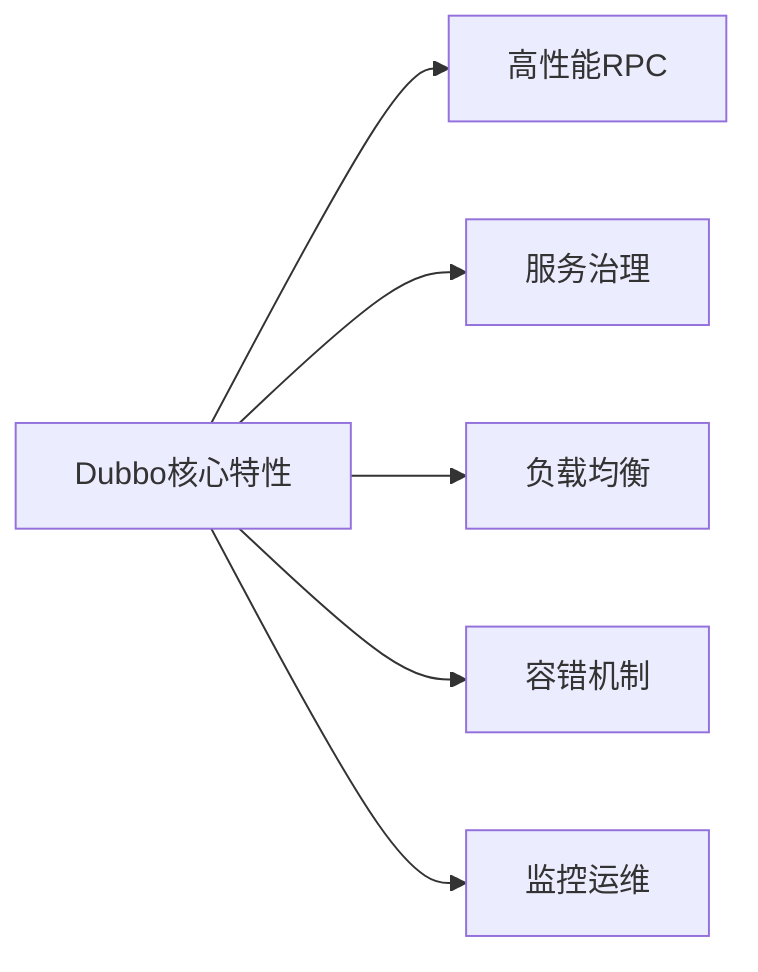
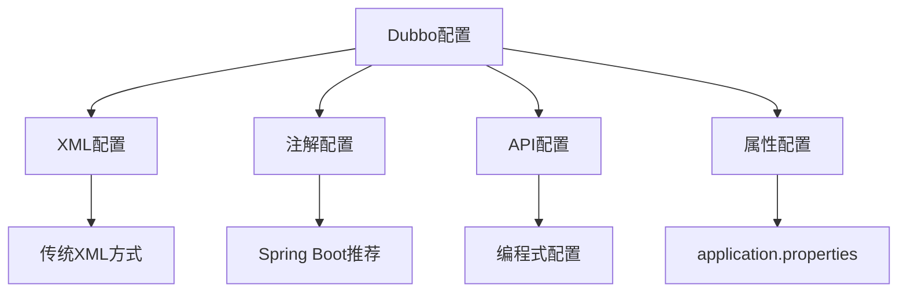
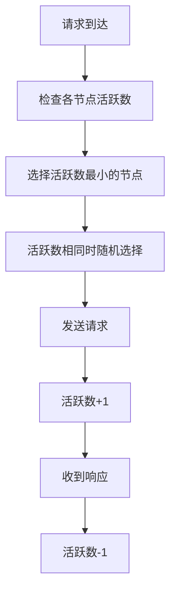
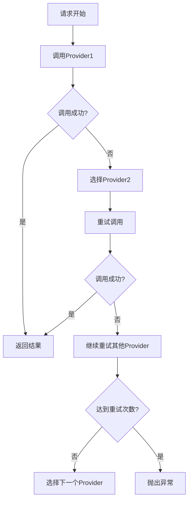

# 🚀 Dubbo实战教学指南 - 从基础到高级应用

## 📖 目录
- [第一章：Dubbo基础入门](#第一章dubbo基础入门)
- [第二章：快速上手 - 你的第一个Dubbo应用](#第二章快速上手---你的第一个dubbo应用)
- [第三章：配置详解 - 驾驭Dubbo的艺术](#第三章配置详解---驾驭dubbo的艺术)
- [第四章：负载均衡详解](#第四章负载均衡详解)
- [第五章：集群容错与故障处理](#第五章集群容错与故障处理)
- [第六章：熔断降级与限流](#第六章熔断降级与限流)
- [第七章：服务治理与路由规则](#第七章服务治理与路由规则)
- [第八章：监控与运维](#第八章监控与运维)
- [第九章：性能调优实战](#第九章性能调优实战)
- [第十章：生产环境最佳实践](#第十章生产环境最佳实践)

---

## 第一章：Dubbo基础入门

### 🎯 什么是Dubbo？

Apache Dubbo是一款高性能的Java RPC框架，主要用于构建分布式微服务应用。它提供了完整的服务治理解决方案，包括服务注册发现、负载均衡、容错机制等。

### 🔍 Dubbo核心特性



#### 🚀 核心功能
- **高性能通信**：基于Netty NIO框架，支持多种协议
- **服务注册发现**：支持Zookeeper、Nacos、Redis等注册中心
- **负载均衡**：提供多种负载均衡算法
- **集群容错**：提供多种容错策略
- **服务治理**：动态配置、路由规则、限流降级

### 🏗️ Dubbo架构简介

```
Provider (服务提供者) --> Registry (注册中心) <-- Consumer (服务消费者)
    ↓                                                   ↓
Monitor (监控中心) <-- 统计信息收集 --> Monitor (监控中心)
```

**角色说明：**
- 🏭 **Provider**：暴露服务的应用
- 🛒 **Consumer**：调用远程服务的应用
- 📋 **Registry**：服务注册与发现中心
- 📊 **Monitor**：监控中心，收集调用统计

### 🛠️ 环境准备

```bash
# 必备环境
✅ JDK 1.8+
✅ Maven 3.6+
✅ IDE (推荐IntelliJ IDEA)
✅ 注册中心 (Zookeeper/Nacos)
```

---

## 第二章：快速上手 - 你的第一个Dubbo应用

### 🛠️ 环境准备

在开始我们的Dubbo之旅前，先准备好工具箱：

```bash
# 必备环境
✅ JDK 1.8+
✅ Maven 3.6+
✅ IDE (IDEA推荐)
✅ Zookeeper 3.4+ (注册中心)
```

### 🏗️ 项目结构设计

```
dubbo-demo/
├── dubbo-api/          # 公共接口模块
│   └── src/main/java/
│       └── com/example/api/
│           └── UserService.java
├── dubbo-provider/     # 服务提供者
│   └── src/main/java/
│       └── com/example/provider/
│           ├── UserServiceImpl.java
│           └── ProviderApplication.java
└── dubbo-consumer/     # 服务消费者
    └── src/main/java/
        └── com/example/consumer/
            └── ConsumerApplication.java
```

### 📦 第一步：定义服务接口

**dubbo-api/pom.xml**
```xml
<dependencies>
    <dependency>
        <groupId>org.apache.dubbo</groupId>
        <artifactId>dubbo</artifactId>
        <version>3.2.5</version>
    </dependency>
</dependencies>
```

**UserService.java** - 我们的明星接口⭐
```java
package com.example.api;

/**
 * 用户服务接口 - 简单而强大！
 */
public interface UserService {
    
    /**
     * 根据ID获取用户信息
     * @param id 用户ID
     * @return 用户信息
     */
    String getUserById(Long id);
    
    /**
     * 获取所有用户数量
     * @return 用户总数
     */
    int getUserCount();
}
```

### 🏭 第二步：实现服务提供者

**dubbo-provider/pom.xml**
```xml
<dependencies>
    <!-- Dubbo核心依赖 -->
    <dependency>
        <groupId>org.apache.dubbo</groupId>
        <artifactId>dubbo</artifactId>
        <version>3.2.5</version>
    </dependency>
    
    <!-- Zookeeper客户端 -->
    <dependency>
        <groupId>org.apache.curator</groupId>
        <artifactId>curator-framework</artifactId>
        <version>5.4.0</version>
    </dependency>
    
    <dependency>
        <groupId>org.apache.curator</groupId>
        <artifactId>curator-recipes</artifactId>
        <version>5.4.0</version>
    </dependency>
    
    <!-- 我们的API接口 -->
    <dependency>
        <groupId>com.example</groupId>
        <artifactId>dubbo-api</artifactId>
        <version>1.0.0</version>
    </dependency>
</dependencies>
```

**UserServiceImpl.java** - 真正干活的实现类💪
```java
package com.example.provider;

import com.example.api.UserService;
import org.apache.dubbo.config.annotation.DubboService;

/**
 * 用户服务实现 - 让接口活起来！
 */
@DubboService(version = "1.0.0", group = "default")
public class UserServiceImpl implements UserService {
    
    @Override
    public String getUserById(Long id) {
        // 模拟数据库查询
        if (id == 1L) {
            return "张三 - Dubbo学习者";
        } else if (id == 2L) {
            return "李四 - 微服务架构师";
        } else {
            return "用户不存在，ID: " + id;
        }
    }
    
    @Override
    public int getUserCount() {
        // 模拟统计用户数量
        return 10086;
    }
}
```

**ProviderApplication.java** - 启动我们的服务🚀
```java
package com.example.provider;

import org.apache.dubbo.config.spring.context.annotation.EnableDubbo;
import org.springframework.boot.SpringApplication;
import org.springframework.boot.autoconfigure.SpringBootApplication;

/**
 * 服务提供者启动类
 */
@SpringBootApplication
@EnableDubbo(scanBasePackages = "com.example.provider")
public class ProviderApplication {
    
    public static void main(String[] args) {
        SpringApplication.run(ProviderApplication.class, args);
        System.out.println("🎉 Dubbo Provider 启动成功！");
    }
}
```

**application.yml** - 配置文件📝
```yaml
# Dubbo配置
dubbo:
  application:
    name: dubbo-provider
    version: 1.0.0
  registry:
    address: zookeeper://127.0.0.1:2181
  protocol:
    name: dubbo
    port: 20880
  provider:
    timeout: 3000
    retries: 0

# Spring Boot配置  
server:
  port: 8080

logging:
  level:
    com.example: DEBUG
    org.apache.dubbo: INFO
```

### 🛒 第三步：创建服务消费者

**dubbo-consumer/pom.xml** (与provider类似)

**ConsumerApplication.java** - 调用远程服务的客户端📞
```java
package com.example.consumer;

import com.example.api.UserService;
import org.apache.dubbo.config.annotation.DubboReference;
import org.apache.dubbo.config.spring.context.annotation.EnableDubbo;
import org.springframework.boot.CommandLineRunner;
import org.springframework.boot.SpringApplication;
import org.springframework.boot.autoconfigure.SpringBootApplication;

/**
 * 服务消费者启动类
 */
@SpringBootApplication
@EnableDubbo
public class ConsumerApplication implements CommandLineRunner {
    
    /**
     * 远程服务引用 - 神奇的注解！✨
     */
    @DubboReference(version = "1.0.0", group = "default")
    private UserService userService;
    
    public static void main(String[] args) {
        SpringApplication.run(ConsumerApplication.class, args);
    }
    
    @Override
    public void run(String... args) throws Exception {
        // 调用远程服务，就像调用本地方法一样！
        System.out.println("🔍 查询用户1: " + userService.getUserById(1L));
        System.out.println("🔍 查询用户2: " + userService.getUserById(2L));
        System.out.println("📊 用户总数: " + userService.getUserCount());
    }
}
```

**application.yml**
```yaml
dubbo:
  application:
    name: dubbo-consumer
  registry:
    address: zookeeper://127.0.0.1:2181
  consumer:
    timeout: 3000
    retries: 0

server:
  port: 8081
```

### 🚀 第四步：启动测试

1. **启动Zookeeper**
```bash
# Windows
zkServer.cmd

# Linux/Mac  
./zkServer.sh start
```

2. **启动Provider**
```bash
cd dubbo-provider
mvn spring-boot:run
```

3. **启动Consumer**
```bash
cd dubbo-consumer  
mvn spring-boot:run
```

**预期输出：**
```
🔍 查询用户1: 张三 - Dubbo学习者
🔍 查询用户2: 李四 - 微服务架构师
📊 用户总数: 10086
```

### 🎉 恭喜！你的第一个Dubbo应用运行成功！

---

## 第三章：配置详解 - 驾驭Dubbo的艺术

### 🎛️ 配置方式全览

Dubbo提供了多种配置方式，灵活多样：



### 📋 应用配置 (Application)

```yaml
dubbo:
  application:
    name: my-app                    # 应用名称
    version: 1.0.0                  # 应用版本
    owner: development-team         # 负责人
    organization: my-company        # 组织名
    architecture: microservice      # 架构类型
    environment: production         # 环境标识
    compiler: javassist            # 动态代理编译器
    logger: slf4j                  # 日志框架
    
    # 应用级参数
    parameters:
      key1: value1
      key2: value2
```

### 🏢 注册中心配置 (Registry)

#### Zookeeper配置
```yaml
dubbo:
  registry:
    address: zookeeper://192.168.1.100:2181,192.168.1.101:2181
    timeout: 5000                  # 连接超时时间
    session: 60000                 # session超时时间
    file: /tmp/dubbo-registry.cache # 本地缓存文件
    check: true                    # 启动时检查注册中心
    username: admin                # 认证用户名
    password: 123456               # 认证密码
    group: /dubbo                  # 根节点
```

#### Nacos配置
```yaml
dubbo:
  registry:
    address: nacos://192.168.1.100:8848
    username: nacos
    password: nacos
    parameters:
      namespace: public
      group: DEFAULT_GROUP
```

#### 多注册中心配置
```yaml
dubbo:
  registries:
    registry1:
      address: zookeeper://192.168.1.100:2181
    registry2:
      address: nacos://192.168.1.101:8848
  
  # 服务使用特定注册中心
  provider:
    registry: registry1
  consumer:
    registry: registry2
```

### 🌐 协议配置 (Protocol)

#### Dubbo协议（推荐）
```yaml
dubbo:
  protocol:
    name: dubbo
    port: 20880                    # 服务端口
    host: 192.168.1.100           # 服务IP
    threads: 200                   # 业务线程池大小
    iothreads: 4                   # IO线程池大小
    accepts: 1000                  # 最大接受连接数
    payload: 8388608               # 请求及响应数据包大小限制
    codec: dubbo                   # 协议编码
    serialization: hessian2        # 序列化方式
    charset: UTF-8                 # 编码格式
    buffer: 8192                   # 网络读写缓冲区大小
    heartbeat: 60000               # 心跳间隔
    accesslog: true                # 访问日志
```

#### 多协议配置
```yaml
dubbo:
  protocols:
    dubbo:
      name: dubbo
      port: 20880
    rest:
      name: rest  
      port: 8080
    grpc:
      name: grpc
      port: 50051
```

### 🏭 提供者配置 (Provider)

```yaml
dubbo:
  provider:
    timeout: 3000                  # 调用超时时间
    retries: 0                     # 重试次数
    loadbalance: random            # 负载均衡策略
    cluster: failfast              # 集群容错策略
    group: default                 # 服务分组
    version: 1.0.0                # 服务版本
    delay: -1                      # 延迟暴露时间
    token: true                    # 令牌验证
    deprecated: false              # 服务是否过时
    dynamic: true                  # 是否动态注册
    accesslog: /tmp/access.log     # 访问日志文件
    document: http://wiki.company.com/service # 服务文档
    
    # 线程池配置
    threadpool: fixed              # 线程池类型
    threads: 200                   # 线程池大小
    queues: 0                      # 队列大小
    
    # 限流配置  
    executes: 200                  # 最大并发执行数
    accepts: 1000                  # 最大接受连接数
```

### 🛒 消费者配置 (Consumer)

```yaml
dubbo:
  consumer:
    timeout: 3000                  # 调用超时时间
    retries: 2                     # 重试次数
    loadbalance: random            # 负载均衡策略
    cluster: failover              # 集群容错策略
    lazy: false                    # 是否懒加载
    sticky: false                  # 粘性连接
    check: true                    # 启动时检查提供者
    connections: 100               # 最大连接数
    
    # 缓存配置
    cache: lru                     # 结果缓存
    validation: false              # 参数验证
    
    # 异步调用配置
    async: false                   # 是否异步调用
    sent: true                     # 异步调用时是否等待发送完成
    return: true                   # 异步调用时是否需要返回值
```

### 🎯 配置优先级

Dubbo配置优先级（从高到低）：

```
1. JVM启动参数 (-D)
2. XML/注解配置  
3. Properties配置文件
4. 默认值
```

示例：
```bash
# JVM参数具有最高优先级
java -Ddubbo.protocol.port=20881 -jar app.jar
```

### 📊 配置中心集成

#### 使用Nacos作为配置中心
```yaml
dubbo:
  config-center:
    address: nacos://192.168.1.100:8848
    username: nacos
    password: nacos
    namespace: dubbo-config
    group: DEFAULT_GROUP
    timeout: 3000
    highest-priority: false        # 是否具有最高优先级
```

#### 动态配置示例
```yaml
# 在Nacos中配置 (dataId: dubbo-provider.yaml)
dubbo:
  provider:
    timeout: 5000
    retries: 1
    loadbalance: leastactive
```

这样配置后，服务可以动态更新超时时间、重试次数等参数，无需重启应用！🎉

---

## 第四章：负载均衡详解

### ⚖️ 负载均衡策略全面解析

负载均衡是分布式系统中的核心组件，Dubbo提供了多种负载均衡算法来分配请求流量。

#### 1. Random（随机）- 默认策略
```java
// 服务提供者配置
@DubboService(loadbalance = "random")
public class UserServiceImpl implements UserService {
    // 随机选择一个提供者
}

// 消费者配置
@DubboReference(loadbalance = "random")
private UserService userService;
```

**特点：**
- ✅ 简单有效，在提供者统计上长期调用比较均匀
- ✅ 实现简单，性能好
- ❌ 短期内可能出现不均匀情况

#### 2. Round Robin（轮询）
```java
@DubboService(loadbalance = "roundrobin")
public class UserServiceImpl implements UserService {
    // 按照轮询方式分配请求
}
```

**配置权重：**
```yaml
dubbo:
  provider:
    parameters:
      server1.weight: 200
      server2.weight: 100
```

**特点：**
- ✅ 请求分配均匀
- ✅ 支持权重配置
- ❌ 存在慢的提供者累积请求的问题

#### 3. Least Active（最少活跃数）⭐ 推荐
```java
@DubboService(loadbalance = "leastactive")
public class UserServiceImpl implements UserService {
    // 活跃数越小，表明该提供者效率越高，单位时间内可处理更多的请求
}
```

**工作原理：**


**特点：**
- ✅ 自适应负载，性能好的机器处理更多请求
- ✅ 能够感知提供者的处理能力
- ✅ 适合处理时间差异较大的场景

#### 4. Shortest Response（最短响应）
```java
@DubboService(loadbalance = "shortestresponse")
public class UserServiceImpl implements UserService {
    // 选择平均响应时间最短的提供者
}
```

**特点：**
- ✅ 能感知提供者响应时间
- ✅ 响应快的机器分配更多请求
- ❌ 计算开销相对较大

#### 5. Consistent Hash（一致性哈希）
```java
@DubboService(loadbalance = "consistenthash")
public class UserServiceImpl implements UserService {
    // 相同参数的请求总是发到同一提供者
}

// 指定哈希参数
@DubboReference(
    loadbalance = "consistenthash",
    parameters = {"hash.arguments", "0"}  // 第一个参数作为哈希键
)
private UserService userService;
```

**应用场景：**
- 📊 **状态化服务**：需要保持会话状态
- 💾 **缓存亲和性**：相同请求命中相同缓存
- 📈 **数据分片**：按用户ID分片存储

### 🎯 负载均衡配置实战

#### 全局配置
```yaml
dubbo:
  provider:
    loadbalance: leastactive    # 全局提供者负载均衡
  consumer:
    loadbalance: leastactive    # 全局消费者负载均衡
```

#### 方法级配置
```java
@Service
public class OrderServiceImpl implements OrderService {
    
    // 查询操作使用最少活跃数
    @DubboReference(loadbalance = "leastactive")
    private UserService userService;
    
    // 创建操作使用一致性哈希
    @DubboReference(
        loadbalance = "consistenthash",
        parameters = {"hash.arguments", "0"}
    )
    private PaymentService paymentService;
}
```

#### 动态配置权重
```java
// 通过Admin或配置中心动态调整
// 服务器性能强的设置高权重
server1: weight=300
server2: weight=200  
server3: weight=100
```

### 📊 负载均衡性能对比

| 策略 | 均匀性 | 响应性 | 复杂度 | 适用场景 |
|------|--------|--------|--------|----------|
| **Random** | ⭐⭐⭐ | ⭐⭐ | ⭐⭐⭐⭐⭐ | 一般业务 |
| **Round Robin** | ⭐⭐⭐⭐⭐ | ⭐⭐ | ⭐⭐⭐⭐ | 同质服务器 |
| **Least Active** | ⭐⭐⭐⭐ | ⭐⭐⭐⭐⭐ | ⭐⭐⭐ | 异质服务器 |
| **Shortest Response** | ⭐⭐⭐⭐ | ⭐⭐⭐⭐⭐ | ⭐⭐ | 响应时间敏感 |
| **Consistent Hash** | ⭐⭐⭐ | ⭐⭐⭐ | ⭐⭐ | 状态化服务 |

---

## 第五章：集群容错与故障处理

### 🛡️ 集群容错策略详解

集群容错是保障分布式系统高可用性的重要机制，Dubbo提供了多种容错策略。

#### 1. Fail-over（失败转移）⭐ 默认策略
```java
@DubboReference(cluster = "failover", retries = 2)
private UserService userService;
```

**配置说明：**

```yaml
dubbo:
  consumer:
    cluster: failover
    retries: 2              # 重试次数，不包括第一次调用
    timeout: 3000           # 超时时间
```

**工作流程：**



**特点：**
- ✅ 透明故障转移，用户无感知
- ✅ 适合读操作
- ❌ 重试会增加延迟
- ⚠️ 写操作可能导致数据重复

#### 2. Fail-fast（快速失败）
```java
@DubboReference(cluster = "failfast")
private OrderService orderService;
```

**特点：**
- ✅ 立即报错，不会重试
- ✅ 适合写操作
- ✅ 避免资源浪费
- ❌ 对瞬时网络错误敏感

#### 3. Fail-safe（失败安全）
```java
@DubboReference(cluster = "failsafe")
private LogService logService;
```

**应用场景：**
- 📊 **日志记录**：失败不影响主流程
- 📈 **审计系统**：可容忍数据丢失
- 🔔 **通知服务**：失败后静默处理

#### 4. Fail-back（失败自动恢复）
```java
@DubboReference(cluster = "failback")
private NotificationService notificationService;

// 配置重试间隔
@DubboReference(
    cluster = "failback",
    parameters = {"retries", "3", "retry.period", "5000"}
)
private EmailService emailService;
```

**工作原理：**
- 失败请求自动记录
- 定时重试失败的请求
- 适合异步操作

#### 5. Forking（并行调用）
```java
@DubboReference(
    cluster = "forking",
    parameters = {"forks", "3"}  // 并行调用3个提供者
)
private RecommendationService recommendationService;
```

**特点：**
- ✅ 并行调用多个提供者
- ✅ 只要一个成功就返回
- ✅ 降低延迟
- ❌ 浪费资源

#### 6. Available（可用优先）
```java
@DubboReference(cluster = "available")
private UserService userService;
```

**特点：**
- 遍历所有提供者
- 找到第一个可用的提供者
- 不进行负载均衡

### 🚨 故障检测与处理

#### 健康检查配置
```yaml
dubbo:
  provider:
    # 心跳检测
    heartbeat: 60000        # 心跳间隔60秒
    
  consumer:
    # 连接检查
    check: true             # 启动时检查提供者
    lazy: false             # 不延迟连接
    sticky: false           # 不使用粘性连接
```

#### 超时处理
```java
@Service
public class OrderServiceImpl implements OrderService {
    
    // 不同方法设置不同超时时间
    @DubboReference(timeout = 1000)  // 查询操作1秒超时
    private UserService userService;
    
    @DubboReference(timeout = 5000)  // 支付操作5秒超时
    private PaymentService paymentService;
}
```

#### 异常处理最佳实践
```java
@Service
public class OrderController {
    
    @DubboReference
    private OrderService orderService;
    
    public Result<Order> createOrder(OrderRequest request) {
        try {
            Order order = orderService.createOrder(request);
            return Result.success(order);
            
        } catch (RpcException e) {
            // RPC异常处理
            if (e.isTimeout()) {
                log.warn("订单创建超时: {}", request.getOrderId());
                return Result.fail("系统繁忙，请稍后重试");
            } else if (e.isNetwork()) {
                log.error("网络异常: {}", e.getMessage());
                return Result.fail("网络异常，请检查网络连接");
            } else {
                log.error("RPC调用异常", e);
                return Result.fail("服务调用失败");
            }
            
        } catch (Exception e) {
            log.error("订单创建失败", e);
            return Result.fail("订单创建失败，请联系客服");
        }
    }
}
```

### 📊 容错策略选择指南

| 业务场景 | 推荐策略 | 配置要点 |
|---------|----------|----------|
| **查询操作** | Fail-over | 设置合理重试次数 |
| **写操作** | Fail-fast | 避免数据重复 |
| **日志记录** | Fail-safe | 允许失败 |
| **通知服务** | Fail-back | 异步重试 |
| **实时推荐** | Forking | 并行调用 |
| **配置获取** | Available | 快速获取 | 

---

## 第六章：熔断降级与限流

### 🔥 熔断器机制

#### Sentinel集成（推荐）
```xml
<dependency>
    <groupId>com.alibaba.cloud</groupId>
    <artifactId>spring-cloud-starter-alibaba-sentinel</artifactId>
</dependency>
```

```java
@Service
public class UserService {
    
    @DubboReference
    private UserQueryService userQueryService;
    
    @SentinelResource(
        value = "getUserInfo",
        fallback = "getUserInfoFallback",
        blockHandler = "getUserInfoBlockHandler"
    )
    public User getUserInfo(Long userId) {
        return userQueryService.getUser(userId);
    }
    
    // 降级方法
    public User getUserInfoFallback(Long userId, Throwable ex) {
        log.warn("获取用户信息失败，userId: {}, error: {}", userId, ex.getMessage());
        return createDefaultUser(userId);
    }
    
    // 限流处理方法
    public User getUserInfoBlockHandler(Long userId, BlockException ex) {
        log.warn("获取用户信息被限流，userId: {}", userId);
        throw new BusinessException("系统繁忙，请稍后重试");
    }
}
```

### 🚰 限流控制

#### QPS限流配置
```yaml
# Sentinel控制台配置
spring:
  cloud:
    sentinel:
      transport:
        dashboard: localhost:8080
        port: 8719
      datasource:
        flow:
          nacos:
            server-addr: localhost:8848
            dataId: order-service-flow-rules
            groupId: SENTINEL_GROUP
            rule-type: flow
```

#### 并发线程限流
```java
@Configuration
public class DubboConfiguration {
    
    @Bean
    public Filter threadLimitFilter() {
        return new Filter() {
            private final AtomicInteger activeCount = new AtomicInteger(0);
            private final int maxConcurrent = 100;
            
            @Override
            public Result invoke(Invoker<?> invoker, Invocation invocation) {
                if (activeCount.incrementAndGet() > maxConcurrent) {
                    activeCount.decrementAndGet();
                    throw new RpcException("服务繁忙，请稍后重试");
                }
                
                try {
                    return invoker.invoke(invocation);
                } finally {
                    activeCount.decrementAndGet();
                }
            }
        };
    }
}
```

### 📉 服务降级策略

#### 多级降级
```java
@Service
public class RecommendationService {
    
    @DubboReference
    private AIRecommendService aiService;
    
    @DubboReference  
    private RuleRecommendService ruleService;
    
    @Autowired
    private RedisTemplate<String, Object> redisTemplate;
    
    public List<Product> getRecommendations(Long userId) {
        try {
            // 第一级：AI推荐
            return aiService.getAIRecommendations(userId);
            
        } catch (Exception e) {
            log.warn("AI推荐服务异常，降级到规则推荐", e);
            
            try {
                // 第二级：规则推荐
                return ruleService.getRuleRecommendations(userId);
                
            } catch (Exception e2) {
                log.warn("规则推荐服务异常，降级到缓存推荐", e2);
                
                // 第三级：缓存推荐
                return getCachedRecommendations(userId);
            }
        }
    }
    
    private List<Product> getCachedRecommendations(Long userId) {
        String cacheKey = "recommend:" + userId;
        List<Product> cached = (List<Product>) redisTemplate.opsForValue().get(cacheKey);
        
        if (cached != null) {
            return cached;
        }
        
        // 兜底：返回热门商品
        return getHotProducts();
    }
}
```

### 🎯 限流降级配置实战

#### 动态配置规则
```json
// Sentinel流控规则
[
  {
    "resource": "getUserInfo",
    "limitApp": "default",
    "grade": 1,
    "count": 100,
    "strategy": 0,
    "controlBehavior": 0,
    "clusterMode": false
  }
]
```

```json
// Sentinel降级规则  
[
  {
    "resource": "paymentService",
    "grade": 2,
    "count": 5000,
    "timeWindow": 10,
    "minRequestAmount": 5,
    "statIntervalMs": 1000,
    "slowRatioThreshold": 0.5
  }
]
```

---

## 第七章：服务治理与路由规则

### 🎯 服务路由规则

#### 条件路由
```yaml
# 基于条件的路由规则
scope: application
key: user-service
rule: |
  - match:
      source:
        region: beijing
    route:
      - destination:
          host: beijing-provider
        weight: 100
  - match:
      source:
        region: shanghai  
    route:
      - destination:
          host: shanghai-provider
        weight: 100
```

#### 标签路由
```java
// 提供者标签配置
@DubboService(parameters = {"tag", "gray"})
public class UserServiceGrayImpl implements UserService {
    // 灰度版本实现
}

@DubboService(parameters = {"tag", "stable"})
public class UserServiceImpl implements UserService {
    // 稳定版本实现
}

// 消费者路由配置
@Component
public class TagRouter implements Router {
    
    @Override
    public <T> List<Invoker<T>> route(List<Invoker<T>> invokers, 
                                     URL url, Invocation invocation) {
        String requestTag = RpcContext.getContext().getAttachment("tag");
        
        if ("gray".equals(requestTag)) {
            return invokers.stream()
                .filter(invoker -> "gray".equals(invoker.getUrl().getParameter("tag")))
                .collect(Collectors.toList());
        }
        
        // 默认路由到稳定版本
        return invokers.stream()
            .filter(invoker -> "stable".equals(invoker.getUrl().getParameter("tag")))
            .collect(Collectors.toList());
    }
}
```

### 🔀 流量分割

#### 基于权重的流量分割
```yaml
# Dubbo Admin配置
scope: application
key: order-service
rule: |
  - match: {}  # 匹配所有请求
    route:
      - destination:
          host: v1-provider
        weight: 70
      - destination:
          host: v2-provider
        weight: 30
```

#### 基于用户的流量分割
```java
@Component
public class UserBasedRouter implements Router {
    
    @Override
    public <T> List<Invoker<T>> route(List<Invoker<T>> invokers, 
                                     URL url, Invocation invocation) {
        Long userId = getUserIdFromRequest(invocation);
        
        // VIP用户路由到高性能服务器
        if (isVipUser(userId)) {
            return invokers.stream()
                .filter(invoker -> "high-performance".equals(
                    invoker.getUrl().getParameter("server.type")))
                .collect(Collectors.toList());
        }
        
        // 普通用户路由到标准服务器
        return invokers.stream()
            .filter(invoker -> "standard".equals(
                invoker.getUrl().getParameter("server.type")))
            .collect(Collectors.toList());
    }
}
```

### 🌐 多注册中心管理

```yaml
dubbo:
  registries:
    beijing:
      address: zookeeper://beijing.zk:2181
      group: beijing
    shanghai:
      address: zookeeper://shanghai.zk:2181  
      group: shanghai
  
  # 服务分别注册到不同注册中心
  provider:
    registry: beijing,shanghai
    
  consumer:
    registry: beijing
```

### 🔧 动态配置管理

#### 配置中心集成
```yaml
dubbo:
  config-center:
    address: nacos://localhost:8848
    namespace: dubbo-config
    group: DEFAULT_GROUP
    timeout: 3000
```

#### 运行时配置更新
```java
@Component
public class ConfigUpdateListener {
    
    @EventListener
    public void onConfigChange(ConfigChangeEvent event) {
        String key = event.getKey();
        String newValue = event.getNewValue();
        
        if ("timeout".equals(key)) {
            // 动态更新超时配置
            updateTimeoutConfig(Integer.parseInt(newValue));
        } else if ("loadbalance".equals(key)) {
            // 动态更新负载均衡策略
            updateLoadBalanceConfig(newValue);
        }
    }
}
```

---

## 第八章：监控与运维

### 📊 Dubbo Admin管理控制台

#### 安装与配置
```bash
# 下载Dubbo Admin
git clone https://github.com/apache/dubbo-admin.git
cd dubbo-admin

# 配置注册中心
vim dubbo-admin-server/src/main/resources/application.properties
admin.registry.address=zookeeper://127.0.0.1:2181
admin.config-center=zookeeper://127.0.0.1:2181
admin.metadata-report.address=zookeeper://127.0.0.1:2181

# 构建和启动
mvn clean package -Dmaven.test.skip=true
java -jar dubbo-admin-distribution/target/dubbo-admin-0.5.0.jar
```

#### 主要功能
- 🎯 **服务治理**：查看所有服务提供者和消费者
- ⚖️ **负载均衡**：动态调整负载均衡策略
- 📈 **监控统计**：实时监控调用量和响应时间
- 🔧 **配置管理**：动态配置服务参数
- 📊 **路由规则**：配置服务路由规则

### 📈 Prometheus + Grafana监控

#### Prometheus集成
```yaml
# 启用metrics
dubbo:
  metrics:
    protocol: prometheus
    port: 9090
    enable-metadata: true
    export: true
```

```xml
<dependency>
    <groupId>org.apache.dubbo</groupId>
    <artifactId>dubbo-metrics-prometheus</artifactId>
    <version>3.2.5</version>
</dependency>
```

#### Grafana Dashboard配置
```json
{
  "dashboard": {
    "title": "Dubbo Metrics",
    "panels": [
      {
        "title": "QPS",
        "targets": [
          {
            "expr": "rate(dubbo_requests_total[5m])",
            "legendFormat": "{{service}}.{{method}}"
          }
        ]
      },
      {
        "title": "Response Time",
        "targets": [
          {
            "expr": "dubbo_requests_duration_seconds",
            "legendFormat": "{{service}}.{{method}}"
          }
        ]
      }
    ]
  }
}
```

### 🕷️ SkyWalking链路追踪

#### Agent配置
```bash
# 启动时添加SkyWalking Agent
java -javaagent:/path/to/skywalking-agent/skywalking-agent.jar \
     -Dskywalking.agent.service_name=user-service \
     -Dskywalking.collector.backend_service=127.0.0.1:11800 \
     -jar user-service.jar
```

#### 自定义埋点
```java
@Component
public class OrderTraceService {
    
    @Trace(operationName = "createOrder")
    public Order createOrder(OrderRequest request) {
        // 添加标签信息
        ActiveSpan span = SkywalkingTracer.createLocalSpan("validate_order");
        span.tag("user.id", request.getUserId());
        span.tag("order.amount", request.getAmount());
        
        try {
            // 业务逻辑
            return processOrder(request);
        } catch (Exception e) {
            span.errorOccurred();
            span.log(e);
            throw e;
        } finally {
            SkywalkingTracer.stopSpan();
        }
    }
}
```

### 🚨 告警配置

#### Prometheus告警规则
```yaml
groups:
  - name: dubbo-alerts
    rules:
      - alert: DubboHighErrorRate
        expr: rate(dubbo_requests_total{status="error"}[5m]) / rate(dubbo_requests_total[5m]) > 0.1
        for: 5m
        labels:
          severity: warning
        annotations:
          summary: "Dubbo服务错误率过高"
          description: "服务 {{ $labels.service }} 错误率超过10%"
          
      - alert: DubboSlowResponse
        expr: dubbo_requests_duration_seconds > 5
        for: 2m
        labels:
          severity: critical
        annotations:
          summary: "Dubbo服务响应缓慢"
          description: "服务 {{ $labels.service }} 响应时间超过5秒"
```

### 📊 自定义监控指标

```java
@Component
public class CustomMetrics {
    
    private final Counter orderCounter = Counter.build()
        .name("orders_total")
        .help("Total orders created")
        .labelNames("status", "region")
        .register();
        
    private final Histogram responseTime = Histogram.build()
        .name("order_processing_duration_seconds")
        .help("Order processing duration")
        .register();
    
    public void recordOrder(String status, String region) {
        orderCounter.labels(status, region).inc();
    }
    
    public void recordProcessingTime(double seconds) {
        responseTime.observe(seconds);
    }
}
```

---

## 第九章：性能调优实战

### 🌐 网络层优化

#### 连接池优化
```yaml
dubbo:
  provider:
    # 网络参数调优
    iothreads: 8               # IO线程数 = CPU核数
    buffer: 16384              # 缓冲区大小 16KB  
    payload: 20971520          # 最大数据包 20MB
    accepts: 1000              # 最大连接数
    
  consumer:
    connections: 5             # 每个提供者的连接数
    lazy: false                # 饥饿连接
```

#### Netty参数调优
```java
@Configuration
public class NettyConfiguration {
    
    @Bean
    public NettyServerConfig nettyServerConfig() {
        NettyServerConfig config = new NettyServerConfig();
        config.setSelectThreads(4);        // Selector线程数
        config.setWorkerThreads(8);        // Worker线程数
        config.setServerSocketSndBufSize(65535);  // 发送缓冲区
        config.setServerSocketRcvBufSize(65535);  // 接收缓冲区
        config.setServerChannelMaxIdleTimeSeconds(120);  // 连接空闲时间
        return config;
    }
    
}
```

### 🔄 序列化优化

#### 序列化性能对比
| 序列化 | 速度 | 大小 | 跨语言 | 推荐场景 |
|-------|------|------|--------|----------|
| **Kryo** | ⭐⭐⭐⭐⭐ | ⭐⭐⭐⭐ | ❌ | 高性能Java内网 |
| **FST** | ⭐⭐⭐⭐ | ⭐⭐⭐⭐ | ❌ | Java高性能场景 |
| **Hessian2** | ⭐⭐⭐ | ⭐⭐⭐ | ✅ | 默认推荐 |
| **Protobuf** | ⭐⭐⭐⭐ | ⭐⭐⭐⭐⭐ | ✅ | 跨语言场景 |

#### Kryo序列化配置
```yaml
dubbo:
  protocol:
    serialization: kryo
    
# 优化Kryo配置
dubbo.serialization.kryo.buffer.size=2048
dubbo.serialization.kryo.max.buffer.size=2048000
```

### 🏊‍♂️ 线程池优化

#### 线程池类型选择
```yaml
dubbo:
  provider:
    threadpool: fixed          # 固定线程池（推荐）
    threads: 200               # 线程数量 = CPU核数 * 2
    queues: 0                  # 队列大小，0表示不排队
    alive: 60000               # 线程存活时间
```

#### 自定义线程池
```java
@Component
public class CustomThreadPool implements ThreadPool {
    
    @Override
    public Executor getExecutor(URL url) {
        String name = url.getParameter("threadname", "Dubbo");
        int threads = url.getParameter("threads", 200);
        int queues = url.getParameter("queues", 0);
        
        return new ThreadPoolExecutor(
            threads, threads, 0, TimeUnit.MILLISECONDS,
            queues == 0 ? new SynchronousQueue<>() 
                        : new LinkedBlockingQueue<>(queues),
            new NamedThreadFactory(name, true),
            new AbortPolicyWithReport(name, url)
        );
    }
}
```

### 💾 连接优化

#### 连接复用配置
```yaml
dubbo:
  consumer:
    connections: 1             # 单连接足够
    sticky: true               # 粘性连接
    lazy: false                # 预热连接
    check: false               # 关闭启动检查，提高启动速度
    
  provider:
    accepts: 1000              # 最大连接数
    transporter: netty4        # 使用Netty4
```

### 🚀 JVM调优

#### GC参数优化
```bash
# G1GC推荐参数
-XX:+UseG1GC
-XX:MaxGCPauseMillis=200
-XX:G1HeapRegionSize=16m
-XX:G1NewSizePercent=30
-XX:G1MaxNewSizePercent=40
-XX:InitiatingHeapOccupancyPercent=45

# 堆内存设置
-Xms4g -Xmx4g
-XX:MetaspaceSize=256m
-XX:MaxMetaspaceSize=512m

# GC日志
-XX:+PrintGCDetails
-XX:+PrintGCTimeStamps
-Xloggc:/path/to/gc.log
```

### 📊 性能基准测试

#### JMH基准测试
```java
@BenchmarkMode(Mode.Throughput)
@OutputTimeUnit(TimeUnit.SECONDS)
@State(Scope.Benchmark)
public class DubboBenchmark {
    
    @DubboReference
    private UserService userService;
    
    @Benchmark
    public User testGetUser() {
        return userService.getUserById(1L);
    }
    
    @Benchmark
    public List<User> testBatchGetUsers() {
        return userService.getUsersByIds(Arrays.asList(1L, 2L, 3L));
    }
}
```

#### 压测脚本
```bash
# wrk压测
wrk -t4 -c100 -d30s --script=dubbo-test.lua http://localhost:8080/api/users/1

# JMeter压测配置
# 线程组：200个并发用户
# 持续时间：5分钟  
# 监控QPS、响应时间、错误率
```

### 🎯 性能调优检查清单

- [ ] **序列化优化**：选择高效序列化方式
- [ ] **连接池调优**：合理设置连接数和线程数
- [ ] **GC优化**：选择合适的垃圾收集器
- [ ] **网络优化**：调整缓冲区大小
- [ ] **监控告警**：建立完善的监控体系
- [ ] **压测验证**：定期进行性能基准测试

---

## 第十章：生产环境最佳实践

### ✅ 接口设计最佳实践

#### 1. 返回值封装
```java
// ✅ 推荐：统一返回值封装
public class Result<T> {
    private boolean success;
    private String message;
    private String errorCode;
    private T data;
    private long timestamp;
    
    public static <T> Result<T> success(T data) {
        Result<T> result = new Result<>();
        result.success = true;
        result.data = data;
        result.timestamp = System.currentTimeMillis();
        return result;
    }
    
    public static <T> Result<T> fail(String errorCode, String message) {
        Result<T> result = new Result<>();
        result.success = false;
        result.errorCode = errorCode;
        result.message = message;
        result.timestamp = System.currentTimeMillis();
        return result;
    }
}

// 服务接口使用统一返回值
public interface UserService {
    Result<User> getUserById(Long userId);
    Result<List<User>> getUsersByIds(List<Long> userIds);
    Result<PageResult<User>> queryUsers(UserQueryRequest request);
}
```

#### 2. 参数校验
```java
@DubboService
public class UserServiceImpl implements UserService {
    
    @Override
    public Result<User> createUser(@Valid CreateUserRequest request) {
        // 参数校验通过注解自动完成
        User user = convertToUser(request);
        userRepository.save(user);
        return Result.success(user);
    }
}

// 请求对象参数校验
public class CreateUserRequest {
    @NotBlank(message = "用户名不能为空")
    @Length(min = 2, max = 20, message = "用户名长度为2-20个字符")
    private String username;
    
    @Email(message = "邮箱格式不正确")
    private String email;
    
    @Pattern(regexp = "^1[3-9]\\d{9}$", message = "手机号格式不正确")
    private String mobile;
}
```

#### 3. 版本管理策略
```java
// 版本演进示例
// v1.0.0 - 初始版本
@DubboService(version = "1.0.0")
public class UserServiceV1 implements UserService {
    Result<User> getUserById(Long id);
}

// v1.1.0 - 新增方法（向后兼容）
@DubboService(version = "1.1.0")  
public class UserServiceV11 implements UserService {
    Result<User> getUserById(Long id);
    Result<List<User>> getUsersByIds(List<Long> ids);  // 新增
}

// v2.0.0 - 不兼容变更，使用新接口
@DubboService(version = "2.0.0")
public class UserServiceV2 implements UserServiceV2 {
    Result<UserDTO> getUserInfo(GetUserRequest request);  // 变更
}
```

### 🔒 安全最佳实践

#### 1. 访问控制
```java
@Component
public class SecurityFilter implements Filter {
    
    @Override
    public Result invoke(Invoker<?> invoker, Invocation invocation) {
        // 检查IP白名单
        String clientIp = RpcContext.getContext().getRemoteHost();
        if (!isAllowedIp(clientIp)) {
            throw new RpcException("访问被拒绝：IP不在白名单中");
        }
        
        // 检查API Key
        String apiKey = RpcContext.getContext().getAttachment("api-key");
        if (!isValidApiKey(apiKey)) {
            throw new RpcException("访问被拒绝：API Key无效");
        }
        
        return invoker.invoke(invocation);
    }
}
```

#### 2. 敏感数据处理
```java
@Service
public class UserServiceImpl implements UserService {
    
    @Override
    public Result<User> getUserById(Long userId) {
        User user = userRepository.findById(userId);
        
        // 脱敏处理
        if (user != null) {
            user.setMobile(maskMobile(user.getMobile()));
            user.setEmail(maskEmail(user.getEmail()));
            user.setIdCard(null);  // 移除敏感信息
        }
        
        return Result.success(user);
    }
    
    private String maskMobile(String mobile) {
        if (mobile == null || mobile.length() < 11) {
            return mobile;
        }
        return mobile.substring(0, 3) + "****" + mobile.substring(7);
    }
}
```

### 🚀 部署最佳实践

#### 1. Docker容器化部署
```dockerfile
FROM openjdk:8-jre-alpine

# 添加应用
COPY target/user-service.jar /app/user-service.jar

# 设置JVM参数
ENV JAVA_OPTS="-Xms1g -Xmx2g -XX:+UseG1GC"

# 健康检查
HEALTHCHECK --interval=30s --timeout=3s --start-period=60s \
  CMD curl -f http://localhost:8080/health || exit 1

EXPOSE 8080 20880

CMD ["sh", "-c", "java $JAVA_OPTS -jar /app/user-service.jar"]
```

#### 2. Kubernetes部署配置
```yaml
apiVersion: apps/v1
kind: Deployment
metadata:
  name: user-service
spec:
  replicas: 3
  selector:
    matchLabels:
      app: user-service
  template:
    metadata:
      labels:
        app: user-service
    spec:
      containers:
      - name: user-service
        image: user-service:latest
        ports:
        - containerPort: 8080
        - containerPort: 20880
        env:
        - name: DUBBO_REGISTRY_ADDRESS
          value: "zookeeper://zk-service:2181"
        resources:
          requests:
            memory: "1Gi"
            cpu: "500m"
          limits:
            memory: "2Gi" 
            cpu: "1000m"
        livenessProbe:
          httpGet:
            path: /health
            port: 8080
          initialDelaySeconds: 60
          periodSeconds: 30
        readinessProbe:
          httpGet:
            path: /ready
            port: 8080
          initialDelaySeconds: 30
          periodSeconds: 10
```

### 🔧 故障排查指南

#### 1. 常见问题诊断
```bash
# 1. 服务连接问题
# 检查注册中心连接
zkCli.sh -server localhost:2181
ls /dubbo/com.example.UserService/providers

# 检查网络连通性
telnet provider-host 20880

# 2. 性能问题排查
# 查看GC情况
jstat -gc pid 1s

# 查看线程状态
jstack pid | grep -A 5 -B 5 "BLOCKED\|WAITING"

# 查看内存使用
jmap -histo pid | head -20

# 3. 应用日志分析
# 查看错误日志
grep -i "error\|exception" application.log | tail -100

# 查看慢请求
grep "slow request" application.log | tail -50
```

#### 2. 应急预案
```java
@Component
public class EmergencyService {
    
    @Value("${emergency.enable:false}")
    private boolean emergencyMode;
    
    public Result<List<Product>> getRecommendations(Long userId) {
        if (emergencyMode) {
            // 应急模式：返回缓存数据
            return getEmergencyRecommendations(userId);
        }
        
        try {
            return recommendationService.getRecommendations(userId);
        } catch (Exception e) {
            log.warn("推荐服务异常，启用应急模式", e);
            return getEmergencyRecommendations(userId);
        }
    }
    
    private Result<List<Product>> getEmergencyRecommendations(Long userId) {
        // 返回热门商品或缓存数据
        List<Product> hotProducts = productCache.getHotProducts();
        return Result.success(hotProducts);
    }
}
```

### 🎯 上线检查清单

#### 部署前检查
- [ ] **代码审查**：通过Code Review
- [ ] **单元测试**：覆盖率 > 80%
- [ ] **集成测试**：核心接口测试通过
- [ ] **压力测试**：性能指标满足要求
- [ ] **安全扫描**：漏洞扫描通过

#### 部署中检查
- [ ] **灰度发布**：先发布部分节点
- [ ] **健康检查**：确认服务启动正常
- [ ] **监控告警**：确认监控指标正常
- [ ] **功能验证**：核心功能正常

#### 部署后检查
- [ ] **性能监控**：响应时间、QPS正常
- [ ] **错误监控**：错误率在正常范围
- [ ] **业务监控**：业务指标正常
- [ ] **告警测试**：验证告警机制有效

### 🎉 总结

通过本教程的学习，我们全面掌握了Dubbo从基础到高级应用的各个方面：

1. **基础入门** - 理解Dubbo架构和核心概念
2. **快速上手** - 搭建第一个Dubbo应用
3. **配置详解** - 掌握各种配置选项
4. **负载均衡** - 选择合适的负载均衡策略
5. **集群容错** - 保障系统高可用性
6. **熔断降级** - 构建稳定的服务调用链
7. **服务治理** - 实现动态配置和路由控制
8. **监控运维** - 建立完善的监控体系
9. **性能调优** - 优化系统性能
10. **生产实践** - 遵循最佳实践确保稳定运行

希望这份教程能够帮助你在微服务架构的道路上走得更远更稳！🚀

---

> 💡 **学习建议**：
> - 💻 **动手实践**：理论结合实践，多写代码
> - 📚 **持续学习**：关注Dubbo社区最新动态
> - 🤝 **经验分享**：参与技术讨论，分享踩坑经验
> - 🔍 **深入源码**：有条件的话阅读Dubbo源码

> 📚 **参考资源**：
> - 官方文档：https://dubbo.apache.org/
> - GitHub：https://github.com/apache/dubbo
> - 中文社区：https://cn.dubbo.apache.org/ 