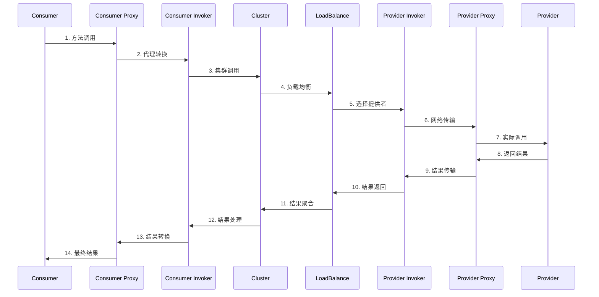
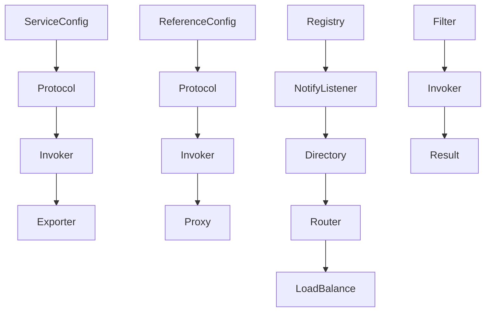
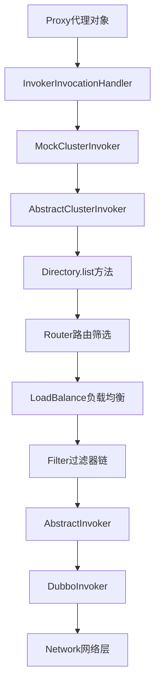
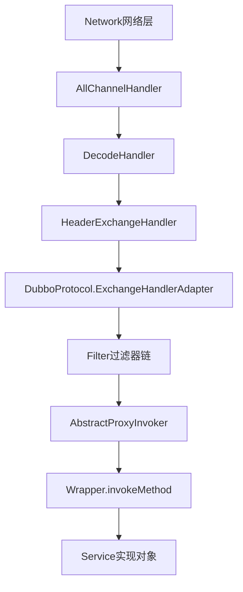

# 🔬 Dubbo核心原理深度解析

## 📖 目录

- [第一章：整体架构原理](#第一章整体架构原理)
- [第二章：服务暴露原理](#第二章服务暴露原理)  
- [第三章：服务引用原理](#第三章服务引用原理)
- [第四章：服务调用原理](#第四章服务调用原理)
- [第五章：注册中心原理](#第五章注册中心原理)
- [第六章：负载均衡原理](#第六章负载均衡原理)
- [第七章：集群容错原理](#第七章集群容错原理)
- [第八章：网络通信原理](#第八章网络通信原理)
- [第九章：序列化原理](#第九章序列化原理)
- [第十章：SPI扩展原理](#第十章SPI扩展原理)

---

## 第一章：整体架构原理

### 🏗️ Dubbo架构层次分析

Dubbo采用分层架构设计，每一层都有明确的职责：

```
┌─────────────────────────────────────────────────┐
│                Business (业务层)                  │
├─────────────────────────────────────────────────┤
│                   RPC (调用层)                   │
├─────────────────────────────────────────────────┤
│                Remoting (远程调用层)              │
├─────────────────────────────────────────────────┤
│                Exchange (信息交换层)              │
├─────────────────────────────────────────────────┤
│                Transport (网络传输层)             │
├─────────────────────────────────────────────────┤
│                Serialize (序列化层)               │
└─────────────────────────────────────────────────┘
```

#### 各层详细职责

**🎯 Business (业务层)**
- 业务逻辑的实现层
- 开发者编写的Service实现类
- 业务异常处理

**📞 RPC (调用层)**
- 对外暴露的调用接口
- 代理对象的生成与管理
- 同步/异步调用的封装

**🌐 Remoting (远程调用层)**
- Protocol：协议抽象层（dubbo://、http://等）
- Invoker：执行器抽象
- Exporter：暴露器抽象

**🔄 Exchange (信息交换层)**
- Request/Response 模型
- 同步转异步
- 心跳检测

**🚛 Transport (网络传输层)**
- 网络传输实现（Netty、Mina等）
- 客户端/服务端抽象
- 连接管理

**📦 Serialize (序列化层)**
- 数据序列化/反序列化
- 支持多种序列化方式
- 性能优化

### 🔄 核心流程概览



### 📊 关键组件关系图



---

## 第二章：服务暴露原理

### 🏭 服务暴露整体流程

服务暴露是Provider启动时的核心流程，分为以下几个阶段：

#### 1. 配置解析阶段

```java
// ServiceBean继承了ServiceConfig
public class ServiceBean<T> extends ServiceConfig<T> 
    implements InitializingBean, ApplicationContextAware {
    
    @Override
    public void afterPropertiesSet() throws Exception {
        // 1. 检查和设置配置
        checkAndUpdateSubConfigs();
        
        // 2. 如果不是延迟暴露，直接暴露
        if (!isDelay()) {
            export();
        }
    }
}
```

#### 2. 服务暴露核心逻辑

```java
public synchronized void export() {
    if (!shouldExport()) {
        return;
    }
    
    // 1. 检查配置
    checkDefault();
    
    // 2. 创建代理对象
    if (ref instanceof GenericService) {
        // 泛化服务处理
        interfaceClass = GenericService.class;
        generic = true;
    } else {
        interfaceClass = ref.getClass();
    }
    
    // 3. 暴露本地服务和远程服务
    doExportUrls();
}

private void doExportUrls() {
    // 加载注册中心配置
    List<URL> registryURLs = loadRegistries(true);
    
    // 遍历所有协议进行暴露
    for (ProtocolConfig protocolConfig : protocols) {
        String pathKey = URL.buildKey(getContextPath(protocolConfig)
            .map(p -> p + "/" + path).orElse(path), group, version);
        
        // 暴露到每个协议
        doExportUrlsFor1Protocol(protocolConfig, registryURLs);
    }
}
```

#### 3. 协议暴露详细过程

```java
private void doExportUrlsFor1Protocol(ProtocolConfig protocolConfig, 
                                     List<URL> registryURLs) {
    // 1. 构建服务URL
    URL url = buildUrl(protocolConfig);
    
    // 2. 本地暴露（用于同JVM内调用）
    if (ExtensionLoader.getExtensionLoader(ConfiguratorFactory.class)
        .hasExtension(url.getProtocol())) {
        url = ConfiguratorFactory.getConfigurator(url).configure(url);
    }
    
    // 3. 远程暴露
    if (registryURLs != null && !registryURLs.isEmpty()) {
        for (URL registryURL : registryURLs) {
            // 动态代理
            Invoker<?> invoker = proxyFactory.getInvoker(ref, interfaceClass, 
                registryURL.addParameterAndEncoded(EXPORT_KEY, url.toFullString()));
            
            // 包装成DelegateProviderMetaDataInvoker
            DelegateProviderMetaDataInvoker wrapperInvoker = 
                new DelegateProviderMetaDataInvoker(invoker, this);
            
            // 协议暴露
            Exporter<?> exporter = protocol.export(wrapperInvoker);
            exporters.add(exporter);
        }
    } else {
        // 直接暴露，不注册到注册中心
        Invoker<?> invoker = proxyFactory.getInvoker(ref, interfaceClass, url);
        DelegateProviderMetaDataInvoker wrapperInvoker = 
            new DelegateProviderMetaDataInvoker(invoker, this);
        
        Exporter<?> exporter = protocol.export(wrapperInvoker);
        exporters.add(exporter);
    }
}
```

### 🎭 Proxy Factory 代理工厂原理

Dubbo使用代理工厂来创建服务的代理对象：

```java
public interface ProxyFactory {
    
    /**
     * 为服务实现创建Invoker
     */
    <T> Invoker<T> getInvoker(T proxy, Class<T> type, URL url) throws RpcException;
    
    /**
     * 为服务接口创建代理对象
     */
    <T> T getProxy(Invoker<T> invoker) throws RpcException;
}
```

#### Javassist 代理实现

```java
public class JavassistProxyFactory extends AbstractProxyFactory {
    
    @Override
    public <T> Invoker<T> getInvoker(T proxy, Class<T> type, URL url) {
        // 动态生成包装类
        final Wrapper wrapper = Wrapper.getWrapper(proxy.getClass().getName().indexOf('$') < 0 
            ? proxy.getClass() : type);
        
        return new AbstractProxyInvoker<T>(proxy, type, url) {
            @Override
            protected Object doInvoke(T proxy, String methodName,
                                    Class<?>[] parameterTypes,
                                    Object[] arguments) throws Throwable {
                // 通过Wrapper调用真实方法
                return wrapper.invokeMethod(proxy, methodName, parameterTypes, arguments);
            }
        };
    }
}
```

#### Wrapper 包装类生成

```java
public abstract class Wrapper {
    
    public static Wrapper getWrapper(Class<?> c) {
        // 1. 检查缓存
        Wrapper ret = WRAPPER_MAP.get(c);
        if (ret == null) {
            // 2. 生成包装类代码
            ret = makeWrapper(c);
            WRAPPER_MAP.put(c, ret);
        }
        return ret;
    }
    
    private static Wrapper makeWrapper(Class<?> c) {
        // 动态生成代码
        StringBuilder code = new StringBuilder();
        code.append("public class Wrapper").append(id).append(" extends Wrapper {\n");
        
        // 生成方法调用代码
        code.append("public Object invokeMethod(Object o, String n, Class[] p, Object[] v) throws Throwable {\n");
        code.append("  ").append(c.getName()).append(" w = (").append(c.getName()).append(")o;\n");
        
        // 为每个方法生成调用分支
        for (Method method : methods) {
            code.append("  if(\"").append(method.getName()).append("\".equals(n)) {\n");
            code.append("    return w.").append(method.getName()).append("(");
            // 参数处理...
            code.append(");\n  }\n");
        }
        
        code.append("}\n");
        
        // 编译并返回实例
        ClassGenerator.newInstance().addInterface(Wrapper.class)
            .setClassName(className).setClassCode(code.toString()).toClass();
    }
}
```

### 🌐 Protocol 协议暴露原理

#### Registry Protocol 注册协议

```java
public class RegistryProtocol implements Protocol {
    
    @Override
    public <T> Exporter<T> export(final Invoker<T> originInvoker) throws RpcException {
        // 1. 获取注册中心URL
        URL registryUrl = getRegistryUrl(originInvoker);
        
        // 2. 获取服务提供者URL
        URL providerUrl = getProviderUrl(originInvoker);
        
        // 3. 向注册中心注册服务
        Registry registry = registryFactory.getRegistry(registryUrl);
        registry.register(providerUrl);
        
        // 4. 暴露到具体协议
        final ExporterChangeableWrapper<T> exporter = 
            new ExporterChangeableWrapper<T>((Exporter<T>) protocol.export(originInvoker), originInvoker);
        
        // 5. 订阅配置变更
        registry.subscribe(subscribeUrl, new NotifyListener() {
            @Override
            public void notify(List<URL> urls) {
                // 处理配置变更
                RegistryProtocol.this.doChangeLocalExport(originInvoker, exporter);
            }
        });
        
        return exporter;
    }
}
```

#### Dubbo Protocol 协议实现

```java
public class DubboProtocol extends AbstractProtocol {
    
    @Override
    public <T> Exporter<T> export(Invoker<T> invoker) throws RpcException {
        URL url = invoker.getUrl();
        
        // 1. 创建服务key
        String key = serviceKey(url);
        
        // 2. 创建DubboExporter
        DubboExporter<T> exporter = new DubboExporter<T>(invoker, key, exporterMap);
        exporterMap.put(key, exporter);
        
        // 3. 启动服务器
        openServer(url);
        
        // 4. 优化序列化
        optimizeSerialization(url);
        
        return exporter;
    }
    
    private void openServer(URL url) {
        String key = url.getAddress();
        boolean isServer = url.getParameter(IS_SERVER_KEY, true);
        
        if (isServer) {
            ExchangeServer server = serverMap.get(key);
            if (server == null) {
                synchronized (this) {
                    server = serverMap.get(key);
                    if (server == null) {
                        // 创建新的服务器
                        serverMap.put(key, createServer(url));
                    }
                }
            } else {
                // 重置服务器配置
                server.reset(url);
            }
        }
    }
}
```

---

## 第三章：服务引用原理

### 🛒 服务引用整体流程

服务引用是Consumer启动时获取远程服务代理的过程：

#### 1. Reference Bean 初始化

```java
public class ReferenceBean<T> extends ReferenceConfig<T> 
    implements FactoryBean, ApplicationContextAware, InitializingBean {
    
    @Override
    public void afterPropertiesSet() throws Exception {
        // 如果没有设置消费者配置，使用默认配置
        if (getConsumer() == null) {
            Map<String, ConsumerConfig> consumerConfigMap = 
                applicationContext.getBeansOfType(ConsumerConfig.class, false, false);
            if (consumerConfigMap != null && consumerConfigMap.size() > 0) {
                ConsumerConfig consumerConfig = null;
                for (ConsumerConfig config : consumerConfigMap.values()) {
                    if (config.isDefault() == null || config.isDefault().booleanValue()) {
                        consumerConfig = config;
                        break;
                    }
                }
                if (consumerConfig != null) {
                    setConsumer(consumerConfig);
                }
            }
        }
    }
    
    @Override
    public Object getObject() {
        return get();
    }
}
```

#### 2. 服务引用核心逻辑

```java
public synchronized T get() {
    if (destroyed) {
        throw new IllegalStateException("The invoker of ReferenceConfig has been destroyed!");
    }
    
    if (ref == null) {
        // 初始化配置
        init();
    }
    return ref;
}

private void init() {
    // 1. 检查配置
    checkDefault();
    checkApplication();
    
    // 2. 创建代理
    createProxy();
}

private void createProxy() {
    // 1. 处理本地引用
    if (shouldJvmRefer(tmpUrl)) {
        URL url = new URL(LOCAL_PROTOCOL, LOCALHOST_VALUE, 0, interfaceClass.getName())
            .addParameters(map);
        invoker = protocol.refer(interfaceClass, url);
    } else {
        // 2. 远程引用
        List<URL> us = loadRegistries(false);
        if (us != null && !us.isEmpty()) {
            for (URL u : us) {
                URL monitorUrl = loadMonitor(u);
                if (monitorUrl != null) {
                    map.put(MONITOR_KEY, URL.encode(monitorUrl.toFullString()));
                }
                // 引用服务
                invoker = protocol.refer(interfaceClass, u);
                break;
            }
        }
    }
    
    // 3. 创建代理对象
    ref = (T) proxyFactory.getProxy(invoker);
}
```

### 🔍 Directory 服务目录原理

Directory负责管理多个Invoker，提供路由和筛选功能：

```java
public abstract class AbstractDirectory<T> implements Directory<T> {
    
    private volatile boolean destroyed = false;
    private volatile URL url;
    private volatile URL consumerUrl;
    private volatile List<Router> routers;
    
    @Override
    public List<Invoker<T>> list(Invocation invocation) throws RpcException {
        if (destroyed) {
            throw new RpcException("Directory already destroyed.");
        }
        
        // 1. 获取所有Invoker
        List<Invoker<T>> invokers = doList(invocation);
        
        // 2. 路由筛选
        List<Router> localRouters = this.routers;
        if (localRouters != null && !localRouters.isEmpty()) {
            for (Router router : localRouters) {
                try {
                    if (router.getUrl() == null || router.getUrl().getParameter(RUNTIME_KEY, false)) {
                        invokers = router.route(invokers, getConsumerUrl(), invocation);
                    }
                } catch (Throwable t) {
                    logger.error("Failed to execute router: " + getUrl() + ", cause: " + t.getMessage(), t);
                }
            }
        }
        
        return invokers;
    }
    
    // 子类实现具体的Invoker列表获取逻辑
    protected abstract List<Invoker<T>> doList(Invocation invocation) throws RpcException;
}
```

#### Registry Directory 注册目录

```java
public class RegistryDirectory<T> extends AbstractDirectory<T> implements NotifyListener {
    
    // 存储所有可用的Invoker
    private volatile Map<String, Invoker<T>> urlInvokerMap;
    
    @Override
    protected List<Invoker<T>> doList(Invocation invocation) {
        if (forbidden) {
            throw new RpcException("Forbid consumer access");
        }
        
        List<Invoker<T>> invokers = null;
        Map<String, Invoker<T>> localUrlInvokerMap = this.urlInvokerMap;
        if (localUrlInvokerMap != null && localUrlInvokerMap.size() > 0) {
            invokers = new ArrayList<Invoker<T>>(localUrlInvokerMap.values());
        }
        
        return invokers == null ? new ArrayList<Invoker<T>>(0) : invokers;
    }
    
    @Override
    public synchronized void notify(List<URL> urls) {
        // 1. 分类URL
        Map<String, List<URL>> categoryMap = new HashMap<String, List<URL>>();
        for (URL url : urls) {
            String category = url.getParameter(CATEGORY_KEY, DEFAULT_CATEGORY);
            List<URL> categoryList = categoryMap.get(category);
            if (categoryList == null) {
                categoryList = new ArrayList<URL>();
                categoryMap.put(category, categoryList);
            }
            categoryList.add(url);
        }
        
        // 2. 处理providers类别
        List<URL> providerURLs = categoryMap.get(PROVIDERS_CATEGORY);
        if (providerURLs != null) {
            refreshInvoker(providerURLs);
        }
        
        // 3. 处理routers类别
        List<URL> routerURLs = categoryMap.get(ROUTERS_CATEGORY);
        if (routerURLs != null) {
            List<Router> routers = toRouters(routerURLs);
            if (routers != null) {
                setRouters(routers);
            }
        }
        
        // 4. 处理configurators类别
        List<URL> configuratorURLs = categoryMap.get(CONFIGURATORS_CATEGORY);
        if (configuratorURLs != null) {
            this.setConfigurators(toConfigurators(configuratorURLs));
        }
    }
}
```

### 🎭 Proxy 代理创建原理

#### JDK动态代理实现

```java
public class JdkProxyFactory extends AbstractProxyFactory {
    
    @Override
    public <T> T getProxy(Invoker<T> invoker, Class<?>[] interfaces) {
        return (T) Proxy.newProxyInstance(
            Thread.currentThread().getContextClassLoader(),
            interfaces,
            new InvokerInvocationHandler(invoker)
        );
    }
}

public class InvokerInvocationHandler implements InvocationHandler {
    
    private final Invoker<?> invoker;
    
    public InvokerInvocationHandler(Invoker<?> handler) {
        this.invoker = handler;
    }
    
    @Override
    public Object invoke(Object proxy, Method method, Object[] args) throws Throwable {
        String methodName = method.getName();
        Class<?>[] parameterTypes = method.getParameterTypes();
        
        // 处理Object方法
        if (method.getDeclaringClass() == Object.class) {
            return method.invoke(invoker, args);
        }
        
        // 处理toString, hashCode, equals方法
        if ("toString".equals(methodName) && parameterTypes.length == 0) {
            return invoker.toString();
        }
        if ("hashCode".equals(methodName) && parameterTypes.length == 0) {
            return invoker.hashCode();
        }
        if ("equals".equals(methodName) && parameterTypes.length == 1) {
            return invoker.equals(args[0]);
        }
        
        // 创建RPC调用
        RpcInvocation rpcInvocation = new RpcInvocation(method, args);
        
        // 执行调用
        Result result = invoker.invoke(rpcInvocation);
        
        // 处理返回值
        return recreate ? result.recreate() : result.getValue();
    }
}
```

---

## 第四章：服务调用原理

### 📞 调用链路详细分析

一次完整的Dubbo调用会经过多个层次的处理：

#### 1. 客户端调用链路



#### 2. 服务端处理链路



### 🔄 Invoker 调用器原理

Invoker是Dubbo中最核心的抽象，代表一个可执行的对象：

```java
public interface Invoker<T> extends Node {
    
    /**
     * 获取服务接口
     */
    Class<T> getInterface();
    
    /**
     * 执行调用
     */
    Result invoke(Invocation invocation) throws RpcException;
}
```

#### Abstract Invoker 抽象实现

```java
public abstract class AbstractInvoker<T> implements Invoker<T> {
    
    private final Class<T> type;
    private final URL url;
    private volatile boolean available = true;
    private AtomicBoolean destroyed = new AtomicBoolean(false);
    
    @Override
    public Result invoke(Invocation inv) throws RpcException {
        // 检查是否已销毁
        if (destroyed.get()) {
            throw new RpcException("Invoker for service " + this + " on consumer is destroyed!");
        }
        
        RpcInvocation invocation = (RpcInvocation) inv;
        invocation.setInvoker(this);
        
        // 添加附件信息
        if (getUrl().getMethodParameter(invocation.getMethodName(), ASYNC_KEY, false)) {
            invocation.put(ASYNC_KEY, Boolean.TRUE);
        }
        
        RpcUtils.attachInvocationIdIfAsync(getUrl(), invocation);
        
        try {
            // 执行具体调用
            return doInvoke(invocation);
        } catch (InvocationTargetException e) {
            Throwable te = e.getTargetException();
            if (te instanceof RpcException) {
                ((RpcException) te).setCode(RpcException.BIZ_EXCEPTION);
            }
            throw new RpcException(te.getMessage(), te);
        } catch (RpcException e) {
            if (e.isBiz()) {
                throw e;
            } else {
                throw new RpcException(e.getCode(), e.getMessage(), e);
            }
        } catch (Throwable e) {
            throw new RpcException(e.getMessage(), e);
        }
    }
    
    // 子类实现具体的调用逻辑
    protected abstract Result doInvoke(Invocation invocation) throws Throwable;
}
```

#### Dubbo Invoker 实现

```java
public class DubboInvoker<T> extends AbstractInvoker<T> {
    
    private final ExchangeClient[] clients;
    private final AtomicPositiveInteger index = new AtomicPositiveInteger();
    private final String version;
    private final ReentrantLock destroyLock = new ReentrantLock();
    
    @Override
    protected Result doInvoke(final Invocation invocation) throws Throwable {
        RpcInvocation inv = (RpcInvocation) invocation;
        final String methodName = RpcUtils.getMethodName(invocation);
        
        // 设置path和version
        inv.put(PATH_KEY, getUrl().getPath());
        inv.put(VERSION_KEY, version);
        
        ExchangeClient currentClient;
        if (clients.length == 1) {
            currentClient = clients[0];
        } else {
            // 轮询选择客户端
            currentClient = clients[index.getAndIncrement() % clients.length];
        }
        
        try {
            // 判断是否异步调用
            boolean isAsync = RpcUtils.isAsync(getUrl(), invocation);
            boolean isOneway = RpcUtils.isOneway(getUrl(), invocation);
            int timeout = getUrl().getMethodParameter(methodName, TIMEOUT_KEY, DEFAULT_TIMEOUT);
            
            if (isOneway) {
                // 单向调用
                boolean isSent = getUrl().getMethodParameter(methodName, SENT_KEY, false);
                currentClient.send(inv, isSent);
                RpcContext.getContext().setFuture(null);
                return new RpcResult();
            } else if (isAsync) {
                // 异步调用
                CompletableFuture<Object> future = currentClient.request(inv, timeout);
                FutureContext.getContext().setCompatibleFuture(future);
                RpcContext.getContext().setFuture(new FutureAdapter(future));
                return new AsyncRpcResult(future, inv);
            } else {
                // 同步调用
                RpcContext.getContext().setFuture(null);
                return (Result) currentClient.request(inv, timeout).get();
            }
        } catch (TimeoutException e) {
            throw new RpcException(RpcException.TIMEOUT_EXCEPTION, 
                "Invoke remote method timeout. method: " + invocation.getMethodName());
        } catch (RemotingException e) {
            throw new RpcException(RpcException.NETWORK_EXCEPTION, 
                "Failed to invoke remote method: " + invocation.getMethodName());
        }
    }
}
```

### 🎯 RPC Invocation 调用信息

RpcInvocation封装了一次RPC调用的所有信息：

```java
public class RpcInvocation implements Invocation {
    
    private String methodName;              // 方法名
    private Class<?>[] parameterTypes;      // 参数类型
    private Object[] arguments;             // 参数值
    private Map<String, String> attachments; // 附件信息
    private transient Invoker<?> invoker;   // 调用器
    
    public RpcInvocation(Method method, Object[] arguments) {
        this(method.getName(), method.getParameterTypes(), arguments, null, null);
    }
    
    public RpcInvocation(String methodName, Class<?>[] parameterTypes, Object[] arguments) {
        this.methodName = methodName;
        this.parameterTypes = parameterTypes == null ? new Class<?>[0] : parameterTypes;
        this.arguments = arguments == null ? new Object[0] : arguments;
    }
    
    @Override
    public String getMethodName() {
        return methodName;
    }
    
    @Override
    public Class<?>[] getParameterTypes() {
        return parameterTypes;
    }
    
    @Override
    public Object[] getArguments() {
        return arguments;
    }
    
    @Override
    public Map<String, String> getAttachments() {
        return attachments != null ? attachments : new HashMap<String, String>();
    }
}
```

### 🔄 Result 结果处理

Result接口封装了调用的返回结果：

```java
public interface Result extends Serializable {
    
    /**
     * 获取返回值
     */
    Object getValue();
    
    /**
     * 获取异常
     */
    Throwable getException();
    
    /**
     * 是否有异常
     */
    boolean hasException();
    
    /**
     * 获取附件信息
     */
    Map<String, String> getAttachments();
    
    /**
     * 重新创建结果（处理异常等）
     */
    Object recreate() throws Throwable;
}
```

#### RpcResult 实现

```java
public class RpcResult implements Result {
    
    private Object result;
    private Throwable exception;
    private Map<String, String> attachments = new HashMap<String, String>();
    
    public RpcResult() {}
    
    public RpcResult(Object result) {
        this.result = result;
    }
    
    public RpcResult(Throwable exception) {
        this.exception = exception;
    }
    
    @Override
    public Object recreate() throws Throwable {
        if (exception != null) {
            throw exception;
        }
        return result;
    }
    
    @Override
    public Object getValue() {
        return result;
    }
    
    @Override
    public Throwable getException() {
        return exception;
    }
    
    @Override
    public boolean hasException() {
        return exception != null;
    }
}
```

#### AsyncRpcResult 异步结果

```java
public class AsyncRpcResult implements Result {
    
    private CompletableFuture<Object> future;
    private RpcInvocation invocation;
    
    public AsyncRpcResult(CompletableFuture<Object> future, RpcInvocation invocation) {
        this.future = future;
        this.invocation = invocation;
    }
    
    @Override
    public Object getValue() {
        try {
            return future.get();
        } catch (Exception e) {
            throw new RpcException(e);
        }
    }
    
    @Override
    public Throwable getException() {
        try {
            future.get();
            return null;
        } catch (ExecutionException e) {
            return e.getCause();
        } catch (Exception e) {
            return e;
        }
    }
    
    public CompletableFuture<Object> getResponseFuture() {
        return future;
    }
}
```

---

## 第五章：注册中心原理

### 🏢 Registry 注册中心接口设计

注册中心是Dubbo服务治理的核心，负责服务的注册、发现和配置管理：

```java
public interface Registry extends Node, RegistryService {
    
}

public interface RegistryService {
    
    /**
     * 注册数据，比如：提供者地址，消费者地址，路由规则，覆盖规则，等数据
     */
    void register(URL url);
    
    /**
     * 取消注册
     */
    void unregister(URL url);
    
    /**
     * 订阅符合条件的已注册数据，当有注册数据变更时自动推送
     */
    void subscribe(URL url, NotifyListener listener);
    
    /**
     * 取消订阅
     */
    void unsubscribe(URL url, NotifyListener listener);
    
    /**
     * 查询符合条件的已注册数据，与订阅的推模式相对应，这里为拉模式，只返回一次结果
     */
    List<URL> lookup(URL url);
}
```

### 🌳 Zookeeper 注册中心实现

Zookeeper是Dubbo默认和最常用的注册中心实现：

```java
public class ZookeeperRegistry extends FailbackRegistry {
    
    private final static String DEFAULT_ROOT = "dubbo";
    private final static String DEFAULT_ZOOKEEPER_PORT = "2181";
    
    private ZkClient zkClient;
    private final String root;
    private final Set<String> anyServices = new ConcurrentHashSet<String>();
    private final ConcurrentMap<URL, ConcurrentMap<NotifyListener, ChildListener>> zkListeners = 
        new ConcurrentHashMap<URL, ConcurrentMap<NotifyListener, ChildListener>>();
    
    public ZookeeperRegistry(URL url, ZookeeperTransporter zookeeperTransporter) {
        super(url);
        if (url.isAnyHost()) {
            throw new IllegalStateException("registry address is invalid");
        }
        
        // 获取根路径
        String group = url.getParameter(GROUP_KEY, DEFAULT_ROOT);
        if (!group.startsWith(PATH_SEPARATOR)) {
            group = PATH_SEPARATOR + group;
        }
        this.root = group;
        
        // 创建ZK客户端
        zkClient = zookeeperTransporter.connect(url);
        zkClient.addStateListener(new StateListener() {
            @Override
            public void stateChanged(int state) {
                if (state == RECONNECTED) {
                    try {
                        recover();
                    } catch (Exception e) {
                        logger.error(e.getMessage(), e);
                    }
                }
            }
        });
    }
    
    @Override
    protected void doRegister(URL url) {
        try {
            // 创建持久化节点路径
            String path = toUrlPath(url);
            zkClient.create(path, false);
        } catch (Throwable e) {
            throw new RpcException("Failed to register " + url + " to zookeeper " + 
                getUrl() + ", cause: " + e.getMessage(), e);
        }
    }
    
    @Override
    protected void doUnregister(URL url) {
        try {
            zkClient.delete(toUrlPath(url));
        } catch (Throwable e) {
            throw new RpcException("Failed to unregister " + url + " to zookeeper " + 
                getUrl() + ", cause: " + e.getMessage(), e);
        }
    }
    
    @Override
    protected void doSubscribe(final URL url, final NotifyListener listener) {
        try {
            if (ANY_VALUE.equals(url.getServiceInterface())) {
                // 订阅所有服务
                String root = toRootPath();
                ConcurrentMap<NotifyListener, ChildListener> listeners = zkListeners.get(url);
                if (listeners == null) {
                    zkListeners.putIfAbsent(url, new ConcurrentHashMap<NotifyListener, ChildListener>());
                    listeners = zkListeners.get(url);
                }
                
                ChildListener zkListener = listeners.get(listener);
                if (zkListener == null) {
                    listeners.putIfAbsent(listener, new ChildListener() {
                        @Override
                        public void childChanged(String parentPath, List<String> currentChilds) {
                            for (String child : currentChilds) {
                                child = URL.decode(child);
                                if (!anyServices.contains(child)) {
                                    anyServices.add(child);
                                    subscribe(url.setPath(child).addParameters(
                                        INTERFACE_KEY, child, 
                                        CHECK_KEY, String.valueOf(false)), listener);
                                }
                            }
                        }
                    });
                    zkListener = listeners.get(listener);
                }
                
                zkClient.create(root, false);
                List<String> services = zkClient.addChildListener(root, zkListener);
                
            } else {
                // 订阅特定服务
                List<URL> urls = new ArrayList<URL>();
                for (String path : toCategoriesPath(url)) {
                    ConcurrentMap<NotifyListener, ChildListener> listeners = zkListeners.get(url);
                    if (listeners == null) {
                        zkListeners.putIfAbsent(url, new ConcurrentHashMap<NotifyListener, ChildListener>());
                        listeners = zkListeners.get(url);
                    }
                    
                    ChildListener zkListener = listeners.get(listener);
                    if (zkListener == null) {
                        listeners.putIfAbsent(listener, new ChildListener() {
                            @Override
                            public void childChanged(String parentPath, List<String> currentChilds) {
                                ZookeeperRegistry.this.notify(url, listener, 
                                    toUrlsWithCategory(url, parentPath, currentChilds));
                            }
                        });
                        zkListener = listeners.get(listener);
                    }
                    
                    zkClient.create(path, false);
                    List<String> children = zkClient.addChildListener(path, zkListener);
                    if (children != null) {
                        urls.addAll(toUrlsWithCategory(url, path, children));
                    }
                }
                notify(url, listener, urls);
            }
        } catch (Throwable e) {
            throw new RpcException("Failed to subscribe " + url + " to zookeeper " + 
                getUrl() + ", cause: " + e.getMessage(), e);
        }
    }
}
```

### 📁 ZooKeeper 节点结构

Dubbo在ZooKeeper中使用以下节点结构：

```
/dubbo
├── com.example.UserService           # 服务接口
│   ├── providers                     # 服务提供者目录
│   │   ├── dubbo://192.168.1.100:20880/com.example.UserService?version=1.0.0&group=default
│   │   └── dubbo://192.168.1.101:20880/com.example.UserService?version=1.0.0&group=default
│   ├── consumers                     # 服务消费者目录
│   │   └── consumer://192.168.1.102/com.example.UserService?version=1.0.0&group=default
│   ├── routers                       # 路由规则目录
│   │   └── condition://0.0.0.0/com.example.UserService?rule=method=getUserById=>host=192.168.1.100
│   └── configurators                 # 配置规则目录
│       └── override://0.0.0.0/com.example.UserService?timeout=5000
```

### 🚨 容错机制 - FailbackRegistry

FailbackRegistry实现了注册中心的容错机制：

```java
public abstract class FailbackRegistry extends AbstractRegistry {
    
    // 重试定时器
    private final ScheduledExecutorService retryExecutor = 
        Executors.newScheduledThreadPool(1, new NamedThreadFactory("DubboRegistryFailedRetryTimer", true));
    
    // 失败的注册请求
    private final Set<URL> failedRegistered = new ConcurrentHashSet<URL>();
    // 失败的取消注册请求  
    private final Set<URL> failedUnregistered = new ConcurrentHashSet<URL>();
    // 失败的订阅请求
    private final ConcurrentMap<URL, Set<NotifyListener>> failedSubscribed = 
        new ConcurrentHashMap<URL, Set<NotifyListener>>();
    // 失败的取消订阅请求
    private final ConcurrentMap<URL, Set<NotifyListener>> failedUnsubscribed = 
        new ConcurrentHashMap<URL, Set<NotifyListener>>();
    
    public FailbackRegistry(URL url) {
        super(url);
        // 启动重试定时器
        this.retryFuture = retryExecutor.scheduleWithFixedDelay(new Runnable() {
            @Override
            public void run() {
                try {
                    retry();
                } catch (Throwable t) {
                    logger.error("Unexpected error occur at failed retry, cause: " + t.getMessage(), t);
                }
            }
        }, retryPeriod, retryPeriod, TimeUnit.MILLISECONDS);
    }
    
    @Override
    public void register(URL url) {
        super.register(url);
        failedRegistered.remove(url);
        failedUnregistered.remove(url);
        try {
            doRegister(url);
        } catch (Exception e) {
            Throwable t = e;
            
            // 记录失败的注册请求到失败列表，定时重试
            failedRegistered.add(url);
            logger.error("Failed to register " + url + " to registry " + getUrl().getAddress() + 
                ", waiting for retry, cause: " + t.getMessage(), t);
        }
    }
    
    @Override
    public void unregister(URL url) {
        super.unregister(url);
        failedRegistered.remove(url);
        failedUnregistered.remove(url);
        try {
            doUnregister(url);
        } catch (Exception e) {
            Throwable t = e;
            
            // 记录失败的取消注册请求到失败列表，定时重试
            failedUnregistered.add(url);
            logger.error("Failed to unregister " + url + " to registry " + getUrl().getAddress() + 
                ", waiting for retry, cause: " + t.getMessage(), t);
        }
    }
    
    protected void retry() {
        if (!failedRegistered.isEmpty()) {
            Set<URL> failed = new HashSet<URL>(failedRegistered);
            if (failed.size() > 0) {
                for (URL url : failed) {
                    try {
                        doRegister(url);
                        failedRegistered.remove(url);
                    } catch (Throwable t) {
                        logger.warn("Failed to retry register " + failed + ", waiting for again, cause: " + 
                            t.getMessage(), t);
                    }
                }
            }
        }
        
        // 重试其他失败操作...
    }
}
```

---

## 第六章：负载均衡原理

### ⚖️ LoadBalance 负载均衡接口

负载均衡是分布式系统中的关键组件，Dubbo提供了多种负载均衡算法：

```java
@SPI(RandomLoadBalance.NAME)
public interface LoadBalance {
    
    /**
     * 从多个Invoker中选择一个
     * @param invokers 候选Invoker列表
     * @param url URL信息
     * @param invocation 调用信息
     * @return 选中的Invoker
     */
    @Adaptive("loadbalance")
    <T> Invoker<T> select(List<Invoker<T>> invokers, URL url, Invocation invocation) throws RpcException;
}
```

#### AbstractLoadBalance 抽象基类

```java
public abstract class AbstractLoadBalance implements LoadBalance {
    
    static int calculateWarmupWeight(int uptime, int warmup, int weight) {
        int ww = (int) ((float) uptime / ((float) warmup / (float) weight));
        return ww < 1 ? 1 : (ww > weight ? weight : ww);
    }
    
    @Override
    public <T> Invoker<T> select(List<Invoker<T>> invokers, URL url, Invocation invocation) {
        if (invokers == null || invokers.isEmpty()) {
            return null;
        }
        
        if (invokers.size() == 1) {
            return invokers.get(0);
        }
        
        return doSelect(invokers, url, invocation);
    }
    
    protected abstract <T> Invoker<T> doSelect(List<Invoker<T>> invokers, URL url, Invocation invocation);
    
    protected int getWeight(Invoker<?> invoker, Invocation invocation) {
        int weight = invoker.getUrl().getMethodParameter(invocation.getMethodName(), WEIGHT_KEY, DEFAULT_WEIGHT);
        if (weight > 0) {
            long timestamp = invoker.getUrl().getParameter(REMOTE_TIMESTAMP_KEY, 0L);
            if (timestamp > 0L) {
                int uptime = (int) (System.currentTimeMillis() - timestamp);
                int warmup = invoker.getUrl().getParameter(WARMUP_KEY, DEFAULT_WARMUP);
                if (uptime > 0 && uptime < warmup) {
                    weight = calculateWarmupWeight(uptime, warmup, weight);
                }
            }
        }
        return weight >= 0 ? weight : 0;
    }
}
```

### 🎲 Random 随机负载均衡

最简单的负载均衡算法，随机选择一个提供者：

```java
public class RandomLoadBalance extends AbstractLoadBalance {
    
    public static final String NAME = "random";
    
    @Override
    protected <T> Invoker<T> doSelect(List<Invoker<T>> invokers, URL url, Invocation invocation) {
        int length = invokers.size();
        boolean sameWeight = true;
        int[] weights = new int[length];
        int firstWeight = getWeight(invokers.get(0), invocation);
        weights[0] = firstWeight;
        int totalWeight = firstWeight;
        
        // 计算总权重，检查权重是否相同
        for (int i = 1; i < length; i++) {
            int weight = getWeight(invokers.get(i), invocation);
            weights[i] = weight;
            totalWeight += weight;
            if (sameWeight && weight != firstWeight) {
                sameWeight = false;
            }
        }
        
        // 如果权重不同，按权重随机选择
        if (totalWeight > 0 && !sameWeight) {
            int offset = ThreadLocalRandom.current().nextInt(totalWeight);
            for (int i = 0; i < length; i++) {
                offset -= weights[i];
                if (offset < 0) {
                    return invokers.get(i);
                }
            }
        }
        
        // 权重相同，直接随机选择
        return invokers.get(ThreadLocalRandom.current().nextInt(length));
    }
}
```

### 🔄 RoundRobin 轮询负载均衡

轮询算法按顺序选择提供者，支持权重：

```java
public class RoundRobinLoadBalance extends AbstractLoadBalance {
    
    public static final String NAME = "roundrobin";
    
    private static final int RECYCLE_PERIOD = 60000;
    
    protected static class WeightedRoundRobin {
        private int weight;
        private AtomicLong current = new AtomicLong(0);
        private long lastUpdate;
        
        public int getWeight() {
            return weight;
        }
        
        public void setWeight(int weight) {
            this.weight = weight;
            current.set(0);
        }
        
        public long increaseCurrent() {
            return current.addAndGet(weight);
        }
        
        public void sel(int total) {
            current.addAndGet(-1 * total);
        }
        
        public long getLastUpdate() {
            return lastUpdate;
        }
        
        public void setLastUpdate(long lastUpdate) {
            this.lastUpdate = lastUpdate;
        }
    }
    
    private ConcurrentMap<String, ConcurrentMap<String, WeightedRoundRobin>> methodWeightMap = 
        new ConcurrentHashMap<String, ConcurrentMap<String, WeightedRoundRobin>>();
    
    @Override
    protected <T> Invoker<T> doSelect(List<Invoker<T>> invokers, URL url, Invocation invocation) {
        String key = invokers.get(0).getUrl().getServiceKey() + "." + invocation.getMethodName();
        ConcurrentMap<String, WeightedRoundRobin> map = methodWeightMap.get(key);
        if (map == null) {
            methodWeightMap.putIfAbsent(key, new ConcurrentHashMap<String, WeightedRoundRobin>());
            map = methodWeightMap.get(key);
        }
        
        int totalWeight = 0;
        long maxCurrent = Long.MIN_VALUE;
        long now = System.currentTimeMillis();
        Invoker<T> selectedInvoker = null;
        WeightedRoundRobin selectedWRR = null;
        
        for (Invoker<T> invoker : invokers) {
            String identifyString = invoker.getUrl().toIdentityString();
            WeightedRoundRobin weightedRoundRobin = map.get(identifyString);
            int weight = getWeight(invoker, invocation);
            
            if (weightedRoundRobin == null) {
                weightedRoundRobin = new WeightedRoundRobin();
                weightedRoundRobin.setWeight(weight);
                map.putIfAbsent(identifyString, weightedRoundRobin);
            }
            
            if (weight != weightedRoundRobin.getWeight()) {
                weightedRoundRobin.setWeight(weight);
            }
            
            long cur = weightedRoundRobin.increaseCurrent();
            weightedRoundRobin.setLastUpdate(now);
            
            if (cur > maxCurrent) {
                maxCurrent = cur;
                selectedInvoker = invoker;
                selectedWRR = weightedRoundRobin;
            }
            
            totalWeight += weight;
        }
        
        if (!updateLock.tryLock()) {
            return selectedInvoker;
        }
        
        try {
            // 清理过期的权重记录
            if (now - lastUpdate > RECYCLE_PERIOD) {
                map.entrySet().removeIf(item -> now - item.getValue().getLastUpdate() > RECYCLE_PERIOD);
                lastUpdate = now;
            }
        } finally {
            updateLock.unlock();
        }
        
        if (selectedInvoker != null) {
            selectedWRR.sel(totalWeight);
            return selectedInvoker;
        }
        
        return invokers.get(0);
    }
}
```

### ⚡ LeastActive 最少活跃负载均衡

最少活跃算法根据活跃请求数选择提供者，活跃数越少说明处理能力越强：

```java
public class LeastActiveLoadBalance extends AbstractLoadBalance {
    
    public static final String NAME = "leastactive";
    
    @Override
    protected <T> Invoker<T> doSelect(List<Invoker<T>> invokers, URL url, Invocation invocation) {
        int length = invokers.size();
        int leastActive = -1;
        int leastCount = 0;
        int[] leastIndexes = new int[length];
        int[] weights = new int[length];
        int totalWeight = 0;
        int firstWeight = 0;
        boolean sameWeight = true;
        
        // 找出活跃数最小的Invoker
        for (int i = 0; i < length; i++) {
            Invoker<T> invoker = invokers.get(i);
            int active = RpcStatus.getStatus(invoker.getUrl(), invocation.getMethodName()).getActive();
            int afterWarmup = getWeight(invoker, invocation);
            weights[i] = afterWarmup;
            
            if (leastActive == -1 || active < leastActive) {
                leastActive = active;
                leastCount = 1;
                leastIndexes[0] = i;
                totalWeight = afterWarmup;
                firstWeight = afterWarmup;
                sameWeight = true;
            } else if (active == leastActive) {
                leastIndexes[leastCount++] = i;
                totalWeight += afterWarmup;
                if (sameWeight && i > 0 && afterWarmup != firstWeight) {
                    sameWeight = false;
                }
            }
        }
        
        // 如果只有一个最小活跃数的Invoker，直接返回
        if (leastCount == 1) {
            return invokers.get(leastIndexes[0]);
        }
        
        // 如果有多个相同最小活跃数的Invoker，按权重随机选择
        if (!sameWeight && totalWeight > 0) {
            int offsetWeight = ThreadLocalRandom.current().nextInt(totalWeight);
            for (int i = 0; i < leastCount; i++) {
                int leastIndex = leastIndexes[i];
                offsetWeight -= weights[leastIndex];
                if (offsetWeight < 0) {
                    return invokers.get(leastIndex);
                }
            }
        }
        
        // 权重相同，随机选择
        return invokers.get(leastIndexes[ThreadLocalRandom.current().nextInt(leastCount)]);
    }
}
```

### 🔗 ConsistentHash 一致性哈希负载均衡

一致性哈希算法确保相同参数的请求总是路由到同一台机器：

```java
public class ConsistentHashLoadBalance extends AbstractLoadBalance {
    
    public static final String NAME = "consistenthash";
    
    private static final String HASH_NODES = "hash.nodes";
    private static final String HASH_ARGUMENTS = "hash.arguments";
    
    private final ConcurrentMap<String, ConsistentHashSelector<?>> selectors = 
        new ConcurrentHashMap<String, ConsistentHashSelector<?>>();
    
    @Override
    protected <T> Invoker<T> doSelect(List<Invoker<T>> invokers, URL url, Invocation invocation) {
        String methodName = RpcUtils.getMethodName(invocation);
        String key = invokers.get(0).getUrl().getServiceKey() + "." + methodName;
        
        int identityHashCode = System.identityHashCode(invokers);
        ConsistentHashSelector<T> selector = (ConsistentHashSelector<T>) selectors.get(key);
        
        if (selector == null || selector.identityHashCode != identityHashCode) {
            selectors.put(key, new ConsistentHashSelector<T>(invokers, methodName, identityHashCode));
            selector = (ConsistentHashSelector<T>) selectors.get(key);
        }
        
        return selector.select(invocation);
    }
    
    private static final class ConsistentHashSelector<T> {
        
        private final TreeMap<Long, Invoker<T>> virtualInvokers;
        private final int replicaNumber;
        private final int identityHashCode;
        private final int[] argumentIndex;
        
        ConsistentHashSelector(List<Invoker<T>> invokers, String methodName, int identityHashCode) {
            this.virtualInvokers = new TreeMap<Long, Invoker<T>>();
            this.identityHashCode = identityHashCode;
            
            URL url = invokers.get(0).getUrl();
            this.replicaNumber = url.getMethodParameter(methodName, HASH_NODES, 160);
            String[] index = COMMA_SPLIT_PATTERN.split(url.getMethodParameter(methodName, HASH_ARGUMENTS, "0"));
            argumentIndex = new int[index.length];
            for (int i = 0; i < index.length; i++) {
                argumentIndex[i] = Integer.parseInt(index[i]);
            }
            
            for (Invoker<T> invoker : invokers) {
                String address = invoker.getUrl().getAddress();
                for (int i = 0; i < replicaNumber / 4; i++) {
                    byte[] digest = md5(address + i);
                    for (int h = 0; h < 4; h++) {
                        long m = hash(digest, h);
                        virtualInvokers.put(m, invoker);
                    }
                }
            }
        }
        
        public Invoker<T> select(Invocation invocation) {
            String key = toKey(invocation.getArguments());
            byte[] digest = md5(key);
            return selectForKey(hash(digest, 0));
        }
        
        private String toKey(Object[] args) {
            StringBuilder buf = new StringBuilder();
            for (int i : argumentIndex) {
                if (i >= 0 && i < args.length) {
                    buf.append(args[i]);
                }
            }
            return buf.toString();
        }
        
        private Invoker<T> selectForKey(long hash) {
            Map.Entry<Long, Invoker<T>> entry = virtualInvokers.ceilingEntry(hash);
            if (entry == null) {
                entry = virtualInvokers.firstEntry();
            }
            return entry.getValue();
        }
        
        private long hash(byte[] digest, int number) {
            return (((long) (digest[3 + number * 4] & 0xFF) << 24)
                | ((long) (digest[2 + number * 4] & 0xFF) << 16)
                | ((long) (digest[1 + number * 4] & 0xFF) << 8)
                | (digest[number * 4] & 0xFF))
                & 0xFFFFFFFFL;
        }
        
        private byte[] md5(String value) {
            MessageDigest md5;
            try {
                md5 = MessageDigest.getInstance("MD5");
            } catch (NoSuchAlgorithmException e) {
                throw new IllegalStateException(e.getMessage(), e);
            }
            md5.reset();
            byte[] bytes = value.getBytes(StandardCharsets.UTF_8);
            md5.update(bytes);
            return md5.digest();
        }
    }
}
```

---

## 第七章：集群容错原理

### 🛡️ Cluster 集群接口设计

集群容错是Dubbo处理分布式环境下服务调用失败的核心机制：

```java
@SPI(FailoverCluster.NAME)
public interface Cluster {
    
    /**
     * 将多个Invoker合并成一个集群Invoker
     */
    @Adaptive
    <T> Invoker<T> join(Directory<T> directory) throws RpcException;
}
```

#### AbstractCluster 抽象实现

```java
public abstract class AbstractCluster implements Cluster {
    
    @Override
    public <T> Invoker<T> join(Directory<T> directory) throws RpcException {
        return buildClusterInterceptors(createInvoker(directory), directory.getUrl().getParameter(REFERENCE_INTERCEPTOR_KEY));
    }
    
    protected abstract <T> AbstractClusterInvoker<T> createInvoker(Directory<T> directory);
    
    private <T> Invoker<T> buildClusterInterceptors(AbstractClusterInvoker<T> clusterInvoker, String key) {
        AbstractClusterInvoker<T> last = clusterInvoker;
        List<ClusterInterceptor> interceptors = ExtensionLoader.getExtensionLoader(ClusterInterceptor.class).getActivateExtension(clusterInvoker.getUrl(), key);
        
        if (!interceptors.isEmpty()) {
            for (int i = interceptors.size() - 1; i >= 0; i--) {
                final ClusterInterceptor interceptor = interceptors.get(i);
                final AbstractClusterInvoker<T> next = last;
                last = new InterceptorInvokerNode<>(clusterInvoker, interceptor, next);
            }
        }
        return last;
    }
}
```

#### AbstractClusterInvoker 抽象集群调用器

```java
public abstract class AbstractClusterInvoker<T> implements Invoker<T> {
    
    protected Directory<T> directory;
    protected boolean availablecheck;
    private AtomicBoolean destroyed = new AtomicBoolean(false);
    
    @Override
    public Result invoke(final Invocation invocation) throws RpcException {
        checkWhetherDestroyed();
        
        // 获取负载均衡器
        LoadBalance loadbalance = null;
        List<Invoker<T>> invokers = list(invocation);
        if (invokers != null && !invokers.isEmpty()) {
            loadbalance = ExtensionLoader.getExtensionLoader(LoadBalance.class).getExtension(invokers.get(0).getUrl()
                .getMethodParameter(RpcUtils.getMethodName(invocation), LOADBALANCE_KEY, DEFAULT_LOADBALANCE));
        }
        
        // 设置调用ID
        RpcUtils.attachInvocationIdIfAsync(getUrl(), invocation);
        
        return doInvoke(invocation, invokers, loadbalance);
    }
    
    protected List<Invoker<T>> list(Invocation invocation) throws RpcException {
        return directory.list(invocation);
    }
    
    protected abstract Result doInvoke(Invocation invocation, List<Invoker<T>> invokers, LoadBalance loadbalance) throws RpcException;
    
    protected Invoker<T> select(LoadBalance loadbalance, Invocation invocation, 
                               List<Invoker<T>> invokers, List<Invoker<T>> selected) throws RpcException {
        
        if (invokers == null || invokers.isEmpty()) {
            return null;
        }
        
        String methodName = invocation == null ? DEFAULT_KEY : invocation.getMethodName();
        boolean sticky = invokers.get(0).getUrl().getMethodParameter(methodName, CLUSTER_STICKY_KEY, DEFAULT_CLUSTER_STICKY);
        
        // 粘性调用
        if (stickyInvoker != null && !invokers.contains(stickyInvoker)) {
            stickyInvoker = null;
        }
        
        if (sticky && stickyInvoker != null && 
            (selected == null || !selected.contains(stickyInvoker))) {
            if (availablecheck && stickyInvoker.isAvailable()) {
                return stickyInvoker;
            }
        }
        
        // 负载均衡选择
        Invoker<T> invoker = doSelect(loadbalance, invocation, invokers, selected);
        
        if (sticky) {
            stickyInvoker = invoker;
        }
        
        return invoker;
    }
}
```

### 🔄 FailoverCluster 失败转移容错

失败转移是默认的容错策略，失败时自动切换到其他提供者：

```java
public class FailoverClusterInvoker<T> extends AbstractClusterInvoker<T> {
    
    @Override
    public Result doInvoke(Invocation invocation, final List<Invoker<T>> invokers, LoadBalance loadbalance) throws RpcException {
        List<Invoker<T>> copyInvokers = invokers;
        checkInvokers(copyInvokers, invocation);
        
        String methodName = RpcUtils.getMethodName(invocation);
        int len = getUrl().getMethodParameter(methodName, RETRIES_KEY, DEFAULT_RETRIES) + 1;
        if (len <= 0) {
            len = 1;
        }
        
        RpcException le = null;
        List<Invoker<T>> invoked = new ArrayList<Invoker<T>>(copyInvokers.size());
        Set<String> providers = new HashSet<String>(len);
        
        for (int i = 0; i < len; i++) {
            if (i > 0) {
                checkWhetherDestroyed();
                copyInvokers = list(invocation);
                checkInvokers(copyInvokers, invocation);
            }
            
            Invoker<T> invoker = select(loadbalance, invocation, copyInvokers, invoked);
            invoked.add(invoker);
            RpcContext.getContext().setInvokers((List) invoked);
            
            try {
                Result result = invoker.invoke(invocation);
                if (le != null && logger.isWarnEnabled()) {
                    logger.warn("Although retry the method " + methodName
                        + " in the service " + getInterface().getName()
                        + " was successful by the provider " + invoker.getUrl().getAddress()
                        + ", but there have been failed providers " + providers
                        + " (" + providers.size() + "/" + copyInvokers.size()
                        + ") from the registry " + directory.getUrl().getAddress()
                        + " on the consumer " + NetUtils.getLocalHost()
                        + " using the dubbo version " + Version.getVersion() + ".");
                }
                return result;
            } catch (RpcException e) {
                if (e.isBiz()) {
                    throw e;
                }
                le = e;
            } catch (Throwable e) {
                le = new RpcException(e.getMessage(), e);
            } finally {
                providers.add(invoker.getUrl().getAddress());
            }
        }
        
        throw new RpcException(le.getCode(), 
            "Failed to invoke the method " + methodName + " in the service " + getInterface().getName() 
            + ". Tried " + len + " times of the providers " + providers 
            + " (" + providers.size() + "/" + copyInvokers.size() 
            + ") from the registry " + directory.getUrl().getAddress() 
            + " on the consumer " + NetUtils.getLocalHost() + " using the dubbo version " + Version.getVersion() 
            + ". Last error is: " + le.getMessage(), le.getCause() != null ? le.getCause() : le);
    }
}
```

### ⚡ FailfastCluster 快速失败容错

快速失败策略只调用一次，失败立即报错，适用于写操作：

```java
public class FailfastClusterInvoker<T> extends AbstractClusterInvoker<T> {
    
    @Override
    public Result doInvoke(Invocation invocation, List<Invoker<T>> invokers, LoadBalance loadbalance) throws RpcException {
        checkInvokers(invokers, invocation);
        Invoker<T> invoker = select(loadbalance, invocation, invokers, null);
        
        try {
            return invoker.invoke(invocation);
        } catch (Throwable e) {
            if (e instanceof RpcException && ((RpcException) e).isBiz()) {
                throw (RpcException) e;
            }
            throw new RpcException(e instanceof RpcException ? ((RpcException) e).getCode() : 0,
                "Failfast invoke providers " + invoker.getUrl() + " " + loadbalance.getClass().getSimpleName()
                + " select from all providers " + invokers + " for service " + getInterface().getName()
                + " method " + invocation.getMethodName() + " on consumer " + NetUtils.getLocalHost()
                + " use dubbo version " + Version.getVersion() 
                + ", but no luck to perform the invocation. Last error is: " + e.getMessage(),
                e.getCause() != null ? e.getCause() : e);
        }
    }
}
```

### 🔇 FailsafeCluster 失败安全容错

失败安全策略失败时忽略异常，适用于监控等不重要的服务：

```java
public class FailsafeClusterInvoker<T> extends AbstractClusterInvoker<T> {
    
    @Override
    public Result doInvoke(Invocation invocation, List<Invoker<T>> invokers, LoadBalance loadbalance) throws RpcException {
        try {
            checkInvokers(invokers, invocation);
            Invoker<T> invoker = select(loadbalance, invocation, invokers, null);
            return invoker.invoke(invocation);
        } catch (Throwable e) {
            logger.error("Failsafe ignore exception: " + e.getMessage(), e);
            return new RpcResult(); // 返回空结果
        }
    }
}
```

---

## 第八章：网络通信原理

### 🌐 Remoting 层架构

Dubbo的网络通信基于Remoting层，采用分层设计：

```
┌─────────────────────────────────────┐
│              Exchange               │  信息交换层
├─────────────────────────────────────┤
│              Transport              │  网络传输层  
├─────────────────────────────────────┤
│              Codec                  │  编解码层
└─────────────────────────────────────┘
```

#### Transport 传输层接口

```java
public interface Transporter {
    
    /**
     * 绑定服务器
     */
    @Adaptive({Constants.SERVER_KEY, Constants.TRANSPORTER_KEY})
    Server bind(URL url, ChannelHandler handler) throws RemotingException;
    
    /**
     * 连接服务器
     */
    @Adaptive({Constants.CLIENT_KEY, Constants.TRANSPORTER_KEY})
    Client connect(URL url, ChannelHandler handler) throws RemotingException;
}
```

#### Netty Transport 实现

```java
public class NettyTransporter implements Transporter {
    
    @Override
    public Server bind(URL url, ChannelHandler listener) throws RemotingException {
        return new NettyServer(url, listener);
    }
    
    @Override
    public Client connect(URL url, ChannelHandler listener) throws RemotingException {
        return new NettyClient(url, listener);
    }
}

public class NettyServer extends AbstractServer implements Server {
    
    private Map<String, Channel> channels; // <ip:port, channel>
    private ServerBootstrap bootstrap;
    private io.netty.channel.Channel channel;
    private EventLoopGroup bossGroup;
    private EventLoopGroup workerGroup;
    
    public NettyServer(URL url, ChannelHandler handler) throws RemotingException {
        super(url, ChannelHandlers.wrap(handler, ExecutorUtil.setThreadName(url, SERVER_THREAD_POOL_NAME)));
    }
    
    @Override
    protected void doOpen() throws Throwable {
        bootstrap = new ServerBootstrap();
        
        bossGroup = new NioEventLoopGroup(1, new DefaultThreadFactory("NettyServerBoss", true));
        workerGroup = new NioEventLoopGroup(getUrl().getPositiveParameter(IO_THREADS_KEY, Constants.DEFAULT_IO_THREADS),
                new DefaultThreadFactory("NettyServerWorker", true));
        
        final NettyServerHandler nettyServerHandler = new NettyServerHandler(getUrl(), this);
        channels = nettyServerHandler.getChannels();
        
        bootstrap.group(bossGroup, workerGroup)
                .channel(NioServerSocketChannel.class)
                .childOption(ChannelOption.TCP_NODELAY, Boolean.TRUE)
                .childOption(ChannelOption.SO_REUSEADDR, Boolean.TRUE)
                .childOption(ChannelOption.ALLOCATOR, PooledByteBufAllocator.DEFAULT)
                .childHandler(new ChannelInitializer<NioSocketChannel>() {
                    @Override
                    protected void initChannel(NioSocketChannel ch) throws Exception {
                        NettyCodecAdapter adapter = new NettyCodecAdapter(getCodec(), getUrl(), NettyServer.this);
                        ch.pipeline()
                                .addLast("decoder", adapter.getDecoder())
                                .addLast("encoder", adapter.getEncoder())
                                .addLast("handler", nettyServerHandler);
                    }
                });
        
        // 绑定端口
        ChannelFuture channelFuture = bootstrap.bind(getBindAddress());
        channelFuture.syncUninterruptibly();
        channel = channelFuture.channel();
    }
    
    @Override
    protected void doClose() throws Throwable {
        try {
            if (channel != null) {
                channel.close();
            }
        } catch (Throwable e) {
            logger.warn(e.getMessage(), e);
        }
        
        try {
            Collection<com.alibaba.dubbo.remoting.Channel> channels = getChannels();
            if (channels != null && !channels.isEmpty()) {
                for (com.alibaba.dubbo.remoting.Channel channel : channels) {
                    try {
                        channel.close();
                    } catch (Throwable e) {
                        logger.warn(e.getMessage(), e);
                    }
                }
            }
        } catch (Throwable e) {
            logger.warn(e.getMessage(), e);
        }
        
        try {
            if (bootstrap != null) {
                bossGroup.shutdownGracefully();
                workerGroup.shutdownGracefully();
            }
        } catch (Throwable e) {
            logger.warn(e.getMessage(), e);
        }
    }
}
```

### 💬 Exchange 信息交换层

Exchange层负责请求响应模式的封装：

```java
public interface ExchangeChannel extends Channel {
    
    /**
     * 发送请求
     */
    CompletableFuture<Object> request(Object request) throws RemotingException;
    
    /**
     * 发送请求（带超时）
     */
    CompletableFuture<Object> request(Object request, int timeout) throws RemotingException;
    
    /**
     * 获取Exchange处理器
     */
    ExchangeHandler getExchangeHandler();
}

public class HeaderExchangeChannel implements ExchangeChannel {
    
    private final Channel channel;
    private volatile boolean closed = false;
    
    @Override
    public CompletableFuture<Object> request(Object request, int timeout) throws RemotingException {
        if (closed) {
            throw new RemotingException(this.getLocalAddress(), null, "Failed to send request " + request + ", cause: The channel " + this + " is closed!");
        }
        
        // 创建请求对象
        Request req = new Request();
        req.setVersion(Version.getProtocolVersion());
        req.setTwoWay(true);
        req.setData(request);
        
        // 创建Future
        DefaultFuture future = DefaultFuture.newFuture(channel, req, timeout);
        
        try {
            channel.send(req);
        } catch (RemotingException e) {
            future.cancel();
            throw e;
        }
        
        return future;
    }
}
```

#### DefaultFuture 异步结果处理

```java
public class DefaultFuture extends CompletableFuture<Object> {
    
    private static final Map<Long, Channel> CHANNELS = new ConcurrentHashMap<Long, Channel>();
    private static final Map<Long, DefaultFuture> FUTURES = new ConcurrentHashMap<Long, DefaultFuture>();
    
    private final long id;
    private final Channel channel;
    private final Request request;
    private final int timeout;
    private final long start = System.currentTimeMillis();
    private volatile long sent;
    
    public static DefaultFuture newFuture(Channel channel, Request request, int timeout) {
        final DefaultFuture future = new DefaultFuture(channel, request, timeout);
        
        // 超时处理
        timeoutCheck(future);
        
        return future;
    }
    
    public static void received(Channel channel, Response response) {
        try {
            DefaultFuture future = FUTURES.remove(response.getId());
            if (future != null) {
                Timeout timeout = future.timeoutCheckTask;
                if (timeout != null) {
                    timeout.cancel();
                }
                future.doReceived(response);
            } else {
                logger.warn("The timeout response finally returned at " 
                    + (new SimpleDateFormat("yyyy-MM-dd HH:mm:ss.SSS").format(new Date())) 
                    + ", response " + response 
                    + (channel == null ? "" : ", channel: " + channel.getLocalAddress() 
                        + " -> " + channel.getRemoteAddress()));
            }
        } finally {
            CHANNELS.remove(response.getId());
        }
    }
    
    private void doReceived(Response res) {
        if (res == null) {
            throw new IllegalStateException("response cannot be null");
        }
        
        if (res.getStatus() == Response.OK) {
            this.complete(res.getResult());
        } else if (res.getStatus() == Response.CLIENT_TIMEOUT || res.getStatus() == Response.SERVER_TIMEOUT) {
            this.completeExceptionally(new TimeoutException(res.getStatus() == Response.SERVER_TIMEOUT, channel, res.getErrorMessage()));
        } else {
            this.completeExceptionally(new RemotingException(channel, res.getErrorMessage()));
        }
    }
}
```

---

## 第九章：序列化原理

### 📦 Serialization 序列化接口

Dubbo支持多种序列化方式，通过SPI机制可扩展：

```java
@SPI("hessian2")
public interface Serialization {
    
    /**
     * 获取内容类型标识
     */
    byte getContentTypeId();
    
    /**
     * 获取内容类型
     */
    String getContentType();
    
    /**
     * 创建序列化器
     */
    @Adaptive
    ObjectOutput serialize(URL url, OutputStream output) throws IOException;
    
    /**
     * 创建反序列化器
     */
    @Adaptive  
    ObjectInput deserialize(URL url, InputStream input) throws IOException;
}
```

### 🚀 Hessian2 序列化实现

Hessian2是Dubbo默认的序列化方式，性能优秀：

```java
public class Hessian2Serialization implements Serialization {
    
    @Override
    public byte getContentTypeId() {
        return HESSIAN2_SERIALIZATION_ID;
    }
    
    @Override
    public String getContentType() {
        return "x-application/hessian2";
    }
    
    @Override
    public ObjectOutput serialize(URL url, OutputStream out) throws IOException {
        return new Hessian2ObjectOutput(out);
    }
    
    @Override
    public ObjectInput deserialize(URL url, InputStream is) throws IOException {
        return new Hessian2ObjectInput(is);
    }
}

public class Hessian2ObjectOutput implements ObjectOutput {
    
    private final Hessian2Output mH2o;
    
    public Hessian2ObjectOutput(OutputStream os) {
        mH2o = new Hessian2Output(os);
        mH2o.setSerializerFactory(Hessian2SerializerFactory.SERIALIZER_FACTORY);
    }
    
    @Override
    public void writeObject(Object obj) throws IOException {
        mH2o.writeObject(obj);
    }
    
    @Override
    public void writeUTF(String v) throws IOException {
        mH2o.writeString(v);
    }
    
    @Override
    public void writeInt(int v) throws IOException {
        mH2o.writeInt(v);
    }
    
    @Override
    public void flushBuffer() throws IOException {
        mH2o.flushBuffer();
    }
}
```

### ⚡ Kryo 序列化实现

Kryo是高性能的序列化框架，适用于高并发场景：

```java
public class KryoSerialization implements Serialization {
    
    @Override
    public byte getContentTypeId() {
        return KRYO_SERIALIZATION_ID;
    }
    
    @Override
    public String getContentType() {
        return "x-application/kryo";
    }
    
    @Override
    public ObjectOutput serialize(URL url, OutputStream output) throws IOException {
        return new KryoObjectOutput(output);
    }
    
    @Override
    public ObjectInput deserialize(URL url, InputStream input) throws IOException {
        return new KryoObjectInput(input);
    }
}

public class KryoObjectOutput implements ObjectOutput {
    
    private Kryo kryo;
    private Output output;
    
    public KryoObjectOutput(OutputStream outputStream) {
        kryo = KryoUtils.get();
        output = new Output(outputStream);
    }
    
    @Override
    public void writeObject(Object obj) throws IOException {
        kryo.writeClassAndObject(output, obj);
    }
    
    @Override
    public void flushBuffer() throws IOException {
        try {
            output.flush();
        } finally {
            KryoUtils.release(kryo);
            kryo = null;
        }
    }
}

// Kryo对象池管理
public class KryoUtils {
    
    private static final ThreadLocal<Kryo> kryos = new ThreadLocal<Kryo>() {
        @Override
        protected Kryo initialValue() {
            Kryo kryo = new Kryo();
            kryo.setReferences(false);
            kryo.setRegistrationRequired(false);
            kryo.setInstantiatorStrategy(new DefaultInstantiatorStrategy(new StdInstantiatorStrategy()));
            return kryo;
        }
    };
    
    public static Kryo get() {
        return kryos.get();
    }
    
    public static void release(Kryo kryo) {
        // Kryo对象可以重用，这里不需要特殊处理
    }
}
```

---

## 第十章：SPI扩展原理

### 🔌 ExtensionLoader 扩展加载器

Dubbo的SPI机制是其强大扩展性的核心，ExtensionLoader是SPI的实现：

```java
public class ExtensionLoader<T> {
    
    private static final ConcurrentMap<Class<?>, ExtensionLoader<?>> EXTENSION_LOADERS = 
        new ConcurrentHashMap<Class<?>, ExtensionLoader<?>>();
    
    private static final ConcurrentMap<Class<?>, Object> EXTENSION_INSTANCES = 
        new ConcurrentHashMap<Class<?>, Object>();
    
    private final Class<?> type;
    private final ExtensionFactory objectFactory;
    
    private final ConcurrentMap<Class<?>, String> cachedNames = new ConcurrentHashMap<Class<?>, String>();
    private final Holder<Map<String, Class<?>>> cachedClasses = new Holder<Map<String, Class<?>>>();
    private final Map<String, Object> cachedActivates = new ConcurrentHashMap<String, Object>();
    private final ConcurrentMap<String, Holder<Object>> cachedInstances = new ConcurrentHashMap<String, Holder<Object>>();
    private final Holder<Object> cachedAdaptiveInstance = new Holder<Object>();
    private volatile Class<?> cachedAdaptiveClass = null;
    private String cachedDefaultName;
    private volatile Throwable createAdaptiveInstanceError;
    
    private Set<Class<?>> cachedWrapperClasses;
    private Map<String, IllegalStateException> exceptions = new ConcurrentHashMap<String, IllegalStateException>();
    
    @SuppressWarnings("unchecked")
    public static <T> ExtensionLoader<T> getExtensionLoader(Class<T> type) {
        if (type == null) {
            throw new IllegalArgumentException("Extension type == null");
        }
        if (!type.isInterface()) {
            throw new IllegalArgumentException("Extension type (" + type + ") is not an interface!");
        }
        if (!withExtensionAnnotation(type)) {
            throw new IllegalArgumentException("Extension type (" + type + 
                ") is not an extension, because it is NOT annotated with @" + SPI.class.getSimpleName() + "!");
        }
        
        ExtensionLoader<T> loader = (ExtensionLoader<T>) EXTENSION_LOADERS.get(type);
        if (loader == null) {
            EXTENSION_LOADERS.putIfAbsent(type, new ExtensionLoader<T>(type));
            loader = (ExtensionLoader<T>) EXTENSION_LOADERS.get(type);
        }
        return loader;
    }
    
    public T getExtension(String name) {
        if (StringUtils.isEmpty(name)) {
            throw new IllegalArgumentException("Extension name == null");
        }
        if ("true".equals(name)) {
            return getDefaultExtension();
        }
        
        final Holder<Object> holder = getOrCreateHolder(name);
        Object instance = holder.get();
        if (instance == null) {
            synchronized (holder) {
                instance = holder.get();
                if (instance == null) {
                    instance = createExtension(name);
                    holder.set(instance);
                }
            }
        }
        return (T) instance;
    }
    
    @SuppressWarnings("unchecked")
    private T createExtension(String name) {
        Class<?> clazz = getExtensionClasses().get(name);
        if (clazz == null) {
            throw findException(name);
        }
        try {
            T instance = (T) EXTENSION_INSTANCES.get(clazz);
            if (instance == null) {
                EXTENSION_INSTANCES.putIfAbsent(clazz, clazz.newInstance());
                instance = (T) EXTENSION_INSTANCES.get(clazz);
            }
            injectExtension(instance);
            
            Set<Class<?>> wrapperClasses = cachedWrapperClasses;
            if (CollectionUtils.isNotEmpty(wrapperClasses)) {
                for (Class<?> wrapperClass : wrapperClasses) {
                    instance = injectExtension((T) wrapperClass.getConstructor(type).newInstance(instance));
                }
            }
            return instance;
        } catch (Throwable t) {
            throw new IllegalStateException("Extension instance (name: " + name + ", class: " +
                type + ") couldn't be instantiated: " + t.getMessage(), t);
        }
    }
    
    private T injectExtension(T instance) {
        try {
            if (objectFactory != null) {
                for (Method method : instance.getClass().getMethods()) {
                    if (isSetter(method)) {
                        // 如果是禁用注入的方法，则跳过
                        if (method.getAnnotation(DisableInject.class) != null) {
                            continue;
                        }
                        Class<?> pt = method.getParameterTypes()[0];
                        if (ReflectUtils.isPrimitives(pt)) {
                            continue;
                        }
                        
                        try {
                            String property = getSetterProperty(method);
                            Object object = objectFactory.getExtension(pt, property);
                            if (object != null) {
                                method.invoke(instance, object);
                            }
                        } catch (Exception e) {
                            logger.error("Failed to inject via method " + method.getName()
                                + " of interface " + type.getName() + ": " + e.getMessage(), e);
                        }
                    }
                }
            }
        } catch (Exception e) {
            logger.error(e.getMessage(), e);
        }
        return instance;
    }
}
```

### 🎯 Adaptive 自适应扩展

Adaptive机制可以根据URL参数动态选择扩展实现：

```java
@Documented
@Retention(RetentionPolicy.RUNTIME)
@Target({ElementType.TYPE, ElementType.METHOD})
public @interface Adaptive {
    
    /**
     * 决定选择哪个扩展实现的URL参数键名
     */
    String[] value() default {};
}

// 使用示例
@SPI("dubbo")
public interface Protocol {
    
    int getDefaultPort();
    
    @Adaptive
    <T> Exporter<T> export(Invoker<T> invoker) throws RpcException;
    
    @Adaptive
    <T> Invoker<T> refer(Class<T> type, URL url) throws RpcException;
    
    void destroy();
}

// 动态生成的适配器类（简化版）
public class Protocol$Adaptive implements Protocol {
    
    public <T> Exporter<T> export(Invoker<T> invoker) throws RpcException {
        if (invoker == null) {
            throw new IllegalArgumentException("Invoker argument == null");
        }
        if (invoker.getUrl() == null) {
            throw new IllegalArgumentException("Invoker argument getUrl() == null");
        }
        
        URL url = invoker.getUrl();
        String extName = (url.getProtocol() == null ? "dubbo" : url.getProtocol());
        if (extName == null) {
            throw new IllegalStateException("Failed to get extension (protocol) name from url");
        }
        
        Protocol extension = ExtensionLoader.getExtensionLoader(Protocol.class).getExtension(extName);
        return extension.export(invoker);
    }
    
    public <T> Invoker<T> refer(Class<T> type, URL url) throws RpcException {
        if (url == null) {
            throw new IllegalArgumentException("url == null");
        }
        
        String extName = (url.getProtocol() == null ? "dubbo" : url.getProtocol());
        if (extName == null) {
            throw new IllegalStateException("Failed to get extension (protocol) name from url");
        }
        
        Protocol extension = ExtensionLoader.getExtensionLoader(Protocol.class).getExtension(extName);
        return extension.refer(type, url);
    }
}
```

### 🔗 Wrapper 包装器机制

Wrapper机制实现了AOP功能，可以对扩展实现进行增强：

```java
// Protocol的包装器实现
public class ProtocolFilterWrapper implements Protocol {
    
    private final Protocol protocol;
    
    public ProtocolFilterWrapper(Protocol protocol) {
        if (protocol == null) {
            throw new IllegalArgumentException("protocol == null");
        }
        this.protocol = protocol;
    }
    
    @Override
    public <T> Exporter<T> export(Invoker<T> invoker) throws RpcException {
        if (REGISTRY_PROTOCOL.equals(invoker.getUrl().getProtocol())) {
            return protocol.export(invoker);
        }
        return protocol.export(buildInvokerChain(invoker, SERVICE_FILTER_KEY, CommonConstants.PROVIDER));
    }
    
    @Override
    public <T> Invoker<T> refer(Class<T> type, URL url) throws RpcException {
        if (REGISTRY_PROTOCOL.equals(url.getProtocol())) {
            return protocol.refer(type, url);
        }
        return buildInvokerChain(protocol.refer(type, url), REFERENCE_FILTER_KEY, CommonConstants.CONSUMER);
    }
    
    private static <T> Invoker<T> buildInvokerChain(final Invoker<T> invoker, String key, String group) {
        Invoker<T> last = invoker;
        List<Filter> filters = ExtensionLoader.getExtensionLoader(Filter.class).getActivateExtension(invoker.getUrl(), key, group);
        
        if (!filters.isEmpty()) {
            for (int i = filters.size() - 1; i >= 0; i--) {
                final Filter filter = filters.get(i);
                final AbstractClusterInvoker<T> next = last;
                last = new Invoker<T>() {
                    
                    @Override
                    public Class<T> getInterface() {
                        return invoker.getInterface();
                    }
                    
                    @Override
                    public URL getUrl() {
                        return invoker.getUrl();
                    }
                    
                    @Override
                    public boolean isAvailable() {
                        return invoker.isAvailable();
                    }
                    
                    @Override
                    public Result invoke(Invocation invocation) throws RpcException {
                        Result asyncResult = filter.invoke(next, invocation);
                        return asyncResult;
                    }
                    
                    @Override
                    public void destroy() {
                        invoker.destroy();
                    }
                };
            }
        }
        
        return last;
    }
}
```

### 🎪 总结

通过这十个章节的深入分析，我们完整地剖析了Dubbo的核心原理：

1. **整体架构** - 分层设计，职责清晰
2. **服务暴露** - 从配置解析到网络暴露的完整流程
3. **服务引用** - 代理创建和服务发现机制
4. **服务调用** - Invoker抽象和调用链路
5. **注册中心** - 服务注册发现的核心机制
6. **负载均衡** - 多种算法的实现原理
7. **集群容错** - 分布式环境下的容错策略
8. **网络通信** - 基于Netty的高性能通信
9. **序列化** - 多种序列化方式的支持
10. **SPI扩展** - 强大的扩展机制设计

Dubbo通过精心设计的架构和丰富的扩展机制，为构建高性能、高可用的分布式系统提供了强有力的支撑。理解这些原理对于更好地使用Dubbo具有重要意义。
